# 落樱接口

背景：

1. 前端开发需要用到后端j接口
2. 使用别人现成系统的功能[搏天api-免费api接口平台 (btstu.cn)](https://api.btstu.cn/)

考虑：

1. 防止攻击（安全性）
2. 不能随便调用（增加限制）
3. 统计调用次数
4. 计费
5. 流量保护（限制单位i时间请求数量）
6. API接入（每开发一个API要复用以上的特性）

## 项目介绍

落樱接口是一个提供接口调用的平台，用户可以注册登录，开通接口调用权限，用户可以调用接口，每次调用会进行统计。

管理员可以发布接口，下线接口，接入接口，可视化接口的调用情况

## 业务流程


## 技术选型

**前端**

- Ant Design Pro

- React

- Ant Design & Pro Components

- Umi
- Umi Request （Axios的封装）

**后端**

- Java
- SpringBoot

## 计划

**初始化**

- 前端
- 后端

**数据库表设计**

**后端**

- **基础功能**
  - 管理员可以对接口进行增删改查
- **接口调用**
  - 开发模拟接口
  - 调用模拟接口
  - 保证调用的安全性（API签名认证）
  - 客户端SDK开发
  - 管理员发布/下线接口
  - 申请签名
  - 在线调用
  - 调用次数统计
- **API网关**
  - 网关是什么
  - 网关的作用
  - 网关的分类
  - 网关的实现
- **结合业务应用网关**
  - 所用特性
  - 业务逻辑
  - 具体实现
  - 补充完整网关的业务逻辑


**前端**

- 基础功能

  - 管理员可以访问前台查看接口

  - 管理员创建接口，更新接口，删除接口
- 接口调用

  - 管理员发布/下线接口
  - 用户浏览接口
  - 用户查看接口文档
  - 在线调用
  - 统计用户调用接口次数
  - 优化系统 -  API网关
- **接口统计**
  - 提供可视化平台，用图表统计接口的调用情况优化整个系统的架构（API网关）

**接口计费与保护**

- 统计用户调用次数

- 限流

- 计费 

- 日志

- 开通

## 需求分析

1. 管理员可以对接口进行增删改查
2. 用户可以访问前台查看，查看接口信息

## 初始化

### 前端

1. 初始化脚手架

```sh
#使用pro-cli 来快速的初始化脚手架。
npm i @ant-design/pro-cli -g
pro create API-OpenPlatform-frontend
```


2. 确认版本


3. 安装依赖

```sh
yarn
```

### 后端

使用SpringBoot 项目初始模板(旧)

## 数据库表设计

**接口信息表interface_info**

id

name 接口名称

description 接口描述

url 接口地址

requestHeader 请求头

responseHeader 响应头

status 接口状态 0-关闭 1-开启

method 请求类型

userId 创建人

isDelete 

createTime

updateTime

```sql
create table interface_info
(
    id             bigint auto_increment comment '主键'
        primary key,
    name           varchar(256)                       not null comment '接口名称',
    description    varchar(1024)                      null comment '接口描述',
    url            varchar(512)                       not null comment '接口地址',
    requestParams  text                               null comment '请求参数',
    requestHeader  text                               null comment '请求头',
    responseHeader text                               null comment '响应头',
    status         tinyint  default 0                 not null comment '接口状态 0-关闭 1-开启',
    method         varchar(256)                       not null comment '请求类型',
    userId         bigint                             not null comment '创建人',
    createTime     datetime default CURRENT_TIMESTAMP not null comment '创建时间',
    updateTime     datetime default CURRENT_TIMESTAMP not null on update CURRENT_TIMESTAMP comment '更新时间',
    idDelete       tinyint  default 0                 not null comment '逻辑删除'
);
```

## 后端

### 基础功能

#### **管理员可以对接口进行增删改查**

1. 使用MybatisX自动生成mapper层和service层的代码


```java
@Data
public class InterfaceInfoAddRequest implements Serializable {
    /**
     * 接口名称
     */
    private String name;

    /**
     * 接口描述
     */
    private String description;

    /**
     * 接口地址
     */
    private String url;

    /**
     * 请求头
     */
    private String requestHeader;

    /**
     * 响应头
     */
    private String responseHeader;

    /**
     * 请求类型
     */
    private String method;
}
```

```java
@EqualsAndHashCode(callSuper = true)
@Data
public class InterfaceInfoQueryRequest extends PageRequest implements Serializable {
    /**
     * id
     */
    private Long id;

    /**
     * 接口名称
     */
    private String name;

    /**
     * 接口描述
     */
    private String description;

    /**
     * 接口地址
     */
    private String url;

    /**
     * 请求头
     */
    private String requestHeader;

    /**
     * 响应头
     */
    private String responseHeader;

    /**
     * 接口状态 0-关闭 1-开启
     */
    private Integer status;

    /**
     * 请求类型
     */
    private String method;

    /**
     * 创建人
     */
    private Long userId;
}
```

```java
@Data
public class InterfaceInfoUpdateRequest implements Serializable {
    /**
     * 主键
     */
    private Long id;

    /**
     * 接口名称
     */
    private String name;

    /**
     * 接口描述
     */
    private String description;

    /**
     * 接口地址
     */
    private String url;

    /**
     * 请求头
     */
    private String requestHeader;

    /**
     * 响应头
     */
    private String responseHeader;

    /**
     * 接口状态 0-关闭 1-开启
     */
    private Integer status;

    /**
     * 请求类型
     */
    private String method;
}
```

```java
public interface InterfaceInfoService extends IService<InterfaceInfo> {

    /**
     * 校验
     *
     * @param interfaceInfo
     * @param add 是否为创建校验
     */
    void validInterfaceInfo(InterfaceInfo interfaceInfo, boolean add);
}
```

```java
@Service
public class InterfaceInfoServiceImpl extends ServiceImpl<InterfaceInfoMapper, InterfaceInfo>
        implements InterfaceInfoService {
    @Override
    public void validInterfaceInfo(InterfaceInfo interfaceInfo, boolean add) {
        Long id = interfaceInfo.getId();
        String name = interfaceInfo.getName();
        String description = interfaceInfo.getDescription();
        String url = interfaceInfo.getUrl();
        String requestHeader = interfaceInfo.getRequestHeader();
        String responseHeader = interfaceInfo.getResponseHeader();
        Integer status = interfaceInfo.getStatus();
        String method = interfaceInfo.getMethod();
        Long userId = interfaceInfo.getUserId();
        Date createTime = interfaceInfo.getCreateTime();
        Date updateTime = interfaceInfo.getUpdateTime();
        Integer idDelete = interfaceInfo.getIdDelete();
        if (interfaceInfo == null) {
            throw new BusinessException(ErrorCode.PARAMS_ERROR);
        }
        // 创建时，所有参数必须非空
        if (add) {
            if (StringUtils.isAnyBlank(name)) {
                throw new BusinessException(ErrorCode.PARAMS_ERROR);
            }
        }
        if (StringUtils.isAnyBlank(name) && name.length() > 50) {
            throw new BusinessException(ErrorCode.PARAMS_ERROR, "接口名称过长");
        }
    }
}
```

2. 复制PostContoller改写成InterfacerInfoController

```java
/**
 * 接口信息
 *
 * @author 落樱的悔恨
 */
@RestController
@RequestMapping("/interfaceInfo")
@Slf4j
public class InterfaceInfoController {

    @Resource
    private InterfaceInfoService interfaceInfoService;

    @Resource
    private UserService userService;

    // region 增删改查

    /**
     * 创建
     *
     * @param interfaceInfoAddRequest
     * @param request
     * @return
     */
    @PostMapping("/add")
    public BaseResponse<Long> addInterfaceInfo(@RequestBody InterfaceInfoAddRequest interfaceInfoAddRequest, HttpServletRequest request) {
        if (interfaceInfoAddRequest == null) {
            throw new BusinessException(ErrorCode.PARAMS_ERROR);
        }
        InterfaceInfo interfaceInfo = new InterfaceInfo();
        BeanUtils.copyProperties(interfaceInfoAddRequest, interfaceInfo);
        // 校验
        interfaceInfoService.validInterfaceInfo(interfaceInfo, true);
        User loginUser = userService.getLoginUser(request);
        interfaceInfo.setUserId(loginUser.getId());
        boolean result = interfaceInfoService.save(interfaceInfo);
        if (!result) {
            throw new BusinessException(ErrorCode.OPERATION_ERROR);
        }
        long newInterfaceInfoId = interfaceInfo.getId();
        return ResultUtils.success(newInterfaceInfoId);
    }

    /**
     * 删除
     *
     * @param deleteRequest
     * @param request
     * @return
     */
    @PostMapping("/delete")
    public BaseResponse<Boolean> deleteInterfaceInfo(@RequestBody DeleteRequest deleteRequest, HttpServletRequest request) {
        if (deleteRequest == null || deleteRequest.getId() <= 0) {
            throw new BusinessException(ErrorCode.PARAMS_ERROR);
        }
        User user = userService.getLoginUser(request);
        long id = deleteRequest.getId();
        // 判断是否存在
        InterfaceInfo oldInterfaceInfo = interfaceInfoService.getById(id);
        if (oldInterfaceInfo == null) {
            throw new BusinessException(ErrorCode.NOT_FOUND_ERROR);
        }
        // 仅本人或管理员可删除
        if (!oldInterfaceInfo.getUserId().equals(user.getId()) && !userService.isAdmin(request)) {
            throw new BusinessException(ErrorCode.NO_AUTH_ERROR);
        }
        boolean b = interfaceInfoService.removeById(id);
        return ResultUtils.success(b);
    }

    /**
     * 更新
     *
     * @param interfaceInfoUpdateRequest
     * @param request
     * @return
     */
    @PostMapping("/update")
    public BaseResponse<Boolean> updateInterfaceInfo(@RequestBody InterfaceInfoUpdateRequest interfaceInfoUpdateRequest,
                                            HttpServletRequest request) {
        if (interfaceInfoUpdateRequest == null || interfaceInfoUpdateRequest.getId() <= 0) {
            throw new BusinessException(ErrorCode.PARAMS_ERROR);
        }
        InterfaceInfo interfaceInfo = new InterfaceInfo();
        BeanUtils.copyProperties(interfaceInfoUpdateRequest, interfaceInfo);
        // 参数校验
        interfaceInfoService.validInterfaceInfo(interfaceInfo, false);
        User user = userService.getLoginUser(request);
        long id = interfaceInfoUpdateRequest.getId();
        // 判断是否存在
        InterfaceInfo oldInterfaceInfo = interfaceInfoService.getById(id);
        if (oldInterfaceInfo == null) {
            throw new BusinessException(ErrorCode.NOT_FOUND_ERROR);
        }
        // 仅本人或管理员可修改
        if (!oldInterfaceInfo.getUserId().equals(user.getId()) && !userService.isAdmin(request)) {
            throw new BusinessException(ErrorCode.NO_AUTH_ERROR);
        }
        boolean result = interfaceInfoService.updateById(interfaceInfo);
        return ResultUtils.success(result);
    }

    /**
     * 根据 id 获取
     *
     * @param id
     * @return
     */
    @GetMapping("/get")
    public BaseResponse<InterfaceInfo> getInterfaceInfoById(long id) {
        if (id <= 0) {
            throw new BusinessException(ErrorCode.PARAMS_ERROR);
        }
        InterfaceInfo interfaceInfo = interfaceInfoService.getById(id);
        return ResultUtils.success(interfaceInfo);
    }

    /**
     * 获取列表（仅管理员可使用）
     *
     * @param interfaceInfoQueryRequest
     * @return
     */
    @AuthCheck(mustRole = "admin")
    @GetMapping("/list")
    public BaseResponse<List<InterfaceInfo>> listInterfaceInfo(InterfaceInfoQueryRequest interfaceInfoQueryRequest) {
        InterfaceInfo interfaceInfoQuery = new InterfaceInfo();
        if (interfaceInfoQueryRequest != null) {
            BeanUtils.copyProperties(interfaceInfoQueryRequest, interfaceInfoQuery);
        }
        QueryWrapper<InterfaceInfo> queryWrapper = new QueryWrapper<>(interfaceInfoQuery);
        List<InterfaceInfo> interfaceInfoList = interfaceInfoService.list(queryWrapper);
        return ResultUtils.success(interfaceInfoList);
    }

    /**
     * 分页获取列表
     *
     * @param interfaceInfoQueryRequest
     * @param request
     * @return
     */
    @GetMapping("/list/page")
    public BaseResponse<Page<InterfaceInfo>> listInterfaceInfoByPage(InterfaceInfoQueryRequest interfaceInfoQueryRequest, HttpServletRequest request) {
        if (interfaceInfoQueryRequest == null) {
            throw new BusinessException(ErrorCode.PARAMS_ERROR);
        }
        InterfaceInfo interfaceInfoQuery = new InterfaceInfo();
        BeanUtils.copyProperties(interfaceInfoQueryRequest, interfaceInfoQuery);
        long current = interfaceInfoQueryRequest.getCurrent();
        long size = interfaceInfoQueryRequest.getPageSize();
        String sortField = interfaceInfoQueryRequest.getSortField();
        String sortOrder = interfaceInfoQueryRequest.getSortOrder();
        String description = interfaceInfoQuery.getDescription();
        // content 需支持模糊搜索
        interfaceInfoQuery.setDescription(null);
        // 限制爬虫
        if (size > 50) {
            throw new BusinessException(ErrorCode.PARAMS_ERROR);
        }
        QueryWrapper<InterfaceInfo> queryWrapper = new QueryWrapper<>(interfaceInfoQuery);
        queryWrapper.like(StringUtils.isNotBlank(description), "description", description);
        queryWrapper.orderBy(StringUtils.isNotBlank(sortField),
                sortOrder.equals(CommonConstant.SORT_ORDER_ASC), sortField);
        Page<InterfaceInfo> interfaceInfoPage = interfaceInfoService.page(new Page<>(current, size), queryWrapper);
        return ResultUtils.success(interfaceInfoPage);
    }

    // endregion

}
```

### 接口调用

#### 开发模拟接口

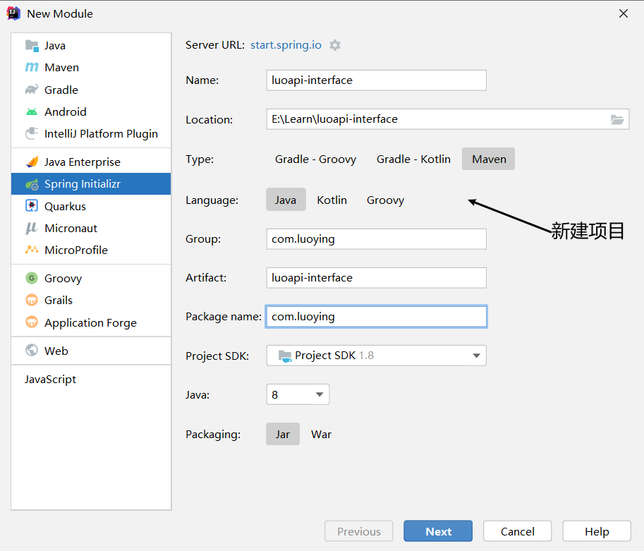

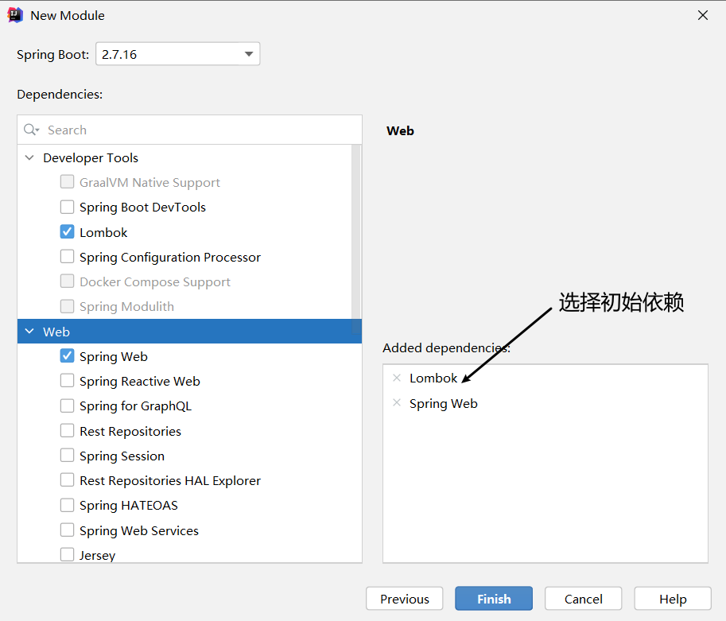

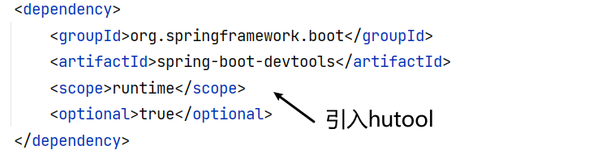

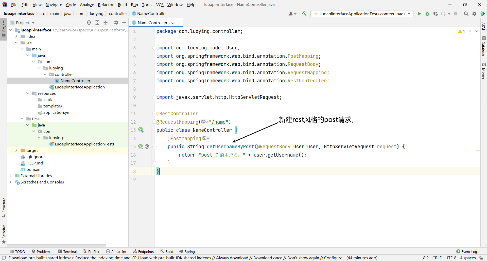


#### 调用模拟接口

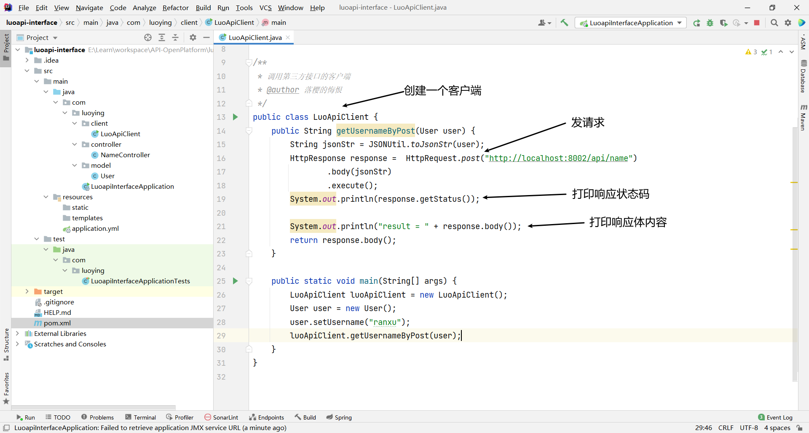

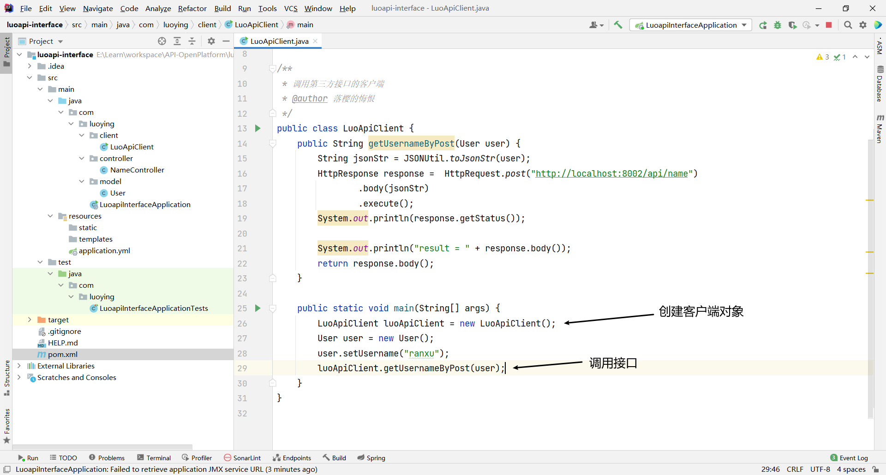

#### API签名认证

**本质**：

1. 签发签名
2. 使用签名（校验签名）

**为什么需要？**

1. 保证安全性，不能随便一个人调用，必须有签发的签名
2. 适用于无需保存登录态的场景，只认签名，不关注用户登录态

**签名认证实现：**

通过http request header头实现

参数1：accessKey：调用者的标识。相当于用户名

参数2：secretKey:密钥（复杂，无规律，无序），开通获取。相当于密码

不能把secretKey放到请求头中，密钥在服务器之间传递，有可能被拦截

参数3：用户参数

参数4：sign，使用 参数3+加密算法生成（不可解密）服务器端用一模一样的参数和算法生成签名，只要和用户传的一致，就能通过。

**防重放：**

参数5：加nonce随机数，只能用一次，服务器要保存用过的随机数

参数6：时间戳，校验时间戳是否过期

```java
/**
 * 调用第三方接口的客户端
 * @author 落樱的悔恨
 */
public class LuoApiClient {
    private String accessKey;
    private String secretKey;

    public LuoApiClient(String accessKey, String secretKey) {
        this.accessKey = accessKey;
        this.secretKey = secretKey;
    }


    public Map<String,String> getHeaders(String body){
        Map<String,String> map=new HashMap<>();
        map.put("accessKey",accessKey);
        // map.put("secretKey",secretKey);不能发送
        // map.put("nonce", RandomUtil.randomNumbers(100));
        map.put("body",body);
        map.put("timestamp",String.valueOf(System.currentTimeMillis()+1*60*1000));
        map.put("sign", SignUtil.genSign(body,secretKey));
        return map;
    }


    public String getUsernameByPost(User user) {
        String jsonStr = JSONUtil.toJsonStr(user);
        HttpResponse response =  HttpRequest.post("http://localhost:8002/api/name")
                .addHeaders(getHeaders(jsonStr))
                .body(jsonStr)
                .execute();
        System.out.println(response.getStatus());

        System.out.println("result = " + response.body());
        return response.body();
    }
    public static void main(String[] args) {
        LuoApiClient luoApiClient = new LuoApiClient("ranxu","abc");
        User user = new User();
        user.setUsername("ranxu");
        luoApiClient.getUsernameByPost(user);
    }
}
```

```java
public class SignUtil {
    public static String genSign(String body, String secretKey){
        Digester SHA256 = new Digester(DigestAlgorithm.SHA256);
        String content = body + ".secretKey" + secretKey;
        return SHA256.digestHex(content.getBytes());
    }
}
```

```java
@RestController
@RequestMapping("/name")
public class NameController {
    @PostMapping
    public String getUsernameByPost(@RequestBody User user, HttpServletRequest request) {
        String accessKey = request.getHeader("accessKey");
        String sign = request.getHeader("sign");
        String body = JSONUtil.toJsonStr(user);
        String timestamp= request.getHeader("timestamp");
        Date timestamp1 = new Date(Long.valueOf(timestamp).longValue());
        //todo 根据accessKey查询数据库，是否存在包含改accessKey的记录
        if (!"ranxu".equals(accessKey) ) {
            throw new RuntimeException("无权限");
        }
        if (timestamp1.before(new Date())){
            throw new RuntimeException("无权限");
        }
        // todo 根据记录获取secretKey
        String dbSign = SignUtil.genSign(body, "abc");
        if (!dbSign.equals(sign)){
            throw new RuntimeException("无权限");
        }
        return "post 你的用户名：" + user.getUsername();
    }
}
```

#### 客户端SDK开发

项目名：luoapi-client-sdk

**为什么需要starter?**

理想情况：开发者只需要关心调用哪些接口，传递哪些参数，就跟调用自己的代码一样

开发starter的好处：开发者引入之后，可以在application.yml中写配置，自动创建客户端

**starter开发流程**

初始化，引入依赖

spring-boot-configuration-processor的作用是自动生成配置的代码提示

```xml
<dependency>
    <groupId>org.springframework.boot</groupId>
    <artifactId>spring-boot-configuration-processor</artifactId>
    <optional>true</optional>
</dependency>
<dependency>
    <groupId>org.projectlombok</groupId>
    <artifactId>lombok</artifactId>
    <optional>true</optional>
</dependency>
<dependency>
    <groupId>cn.hutool</groupId>
    <artifactId>hutool-all</artifactId>
    <version>5.8.8</version>
</dependency>
```

编写配置类

```java
@Configuration
@ConfigurationProperties("luoapi.client")
@Data
@ComponentScan
public class LuoApiClientConfig {

    private String accessKey;
    private String secretKey;

    @Bean
    public LuoApiClient luoApiClient(){
        return new LuoApiClient(accessKey, secretKey);
    }
}
```

注册配置类，resources/META-INF/spring.factories文件

```xml
# springboot starter
org.springframework.boot.autoconfigure.EnableAutoConfiguration=com.luoying.LuoApiClientConfig
```

mvn install打包代码为本地依赖包

创建新项目，测试

#### 管理员发布/下线接口

**接口发布**（仅管理员可操作）

1. 校验该接口是否存在
2. 判断该接口是否可以调用
3. 修改接口数据库中接口的状态字段为1

```java
/**
 * 发布
 *
 * @param idRequest
 * @param request
 * @return
 */
@PostMapping("/online")
@AuthCheck(mustRole = "admin")
public BaseResponse<Boolean> onlineInterfaceInfo(@RequestBody IdRequest idRequest,
                                                 HttpServletRequest request) {
    if (idRequest == null || idRequest.getId() <= 0) {
        throw new BusinessException(ErrorCode.PARAMS_ERROR);
    }
    // 判断接口是否存在
    long id = idRequest.getId();
    InterfaceInfo oldInterfaceInfo = interfaceInfoService.getById(id);
    if (oldInterfaceInfo == null) {
        throw new BusinessException(ErrorCode.NOT_FOUND_ERROR);
    }
    //判断该接口是否可以调用
    com.luoying.model.User user = new com.luoying.model.User();
    user.setUsername("冉旭");
    String username = luoApiClient.getUsernameByPost(user);
    if (StringUtils.isBlank(username)){
        throw new BusinessException(ErrorCode.SYSTEM_ERROR,"接口验证失败");
    }
    //修改接口数据库中接口的状态字段为1
    oldInterfaceInfo.setStatus(InterfaceInfoStatusEnum.ONLINE.getValue());
    boolean result = interfaceInfoService.save(oldInterfaceInfo);
    return ResultUtils.success(result);
}
```

**接口下线**（仅管理员可操作）

1. 校验该接口是否存在
2. 修改接口数据库中接口的状态字段为0

```java
/**
 * 下线
 *
 * @param idRequest
 * @param request
 * @return
 */
@PostMapping("/offline")
@AuthCheck(mustRole = "admin")
public BaseResponse<Boolean> offlineInterfaceInfo(@RequestBody IdRequest idRequest,
                                                  HttpServletRequest request) {
    // 参数校验
    if (idRequest == null || idRequest.getId() <= 0) {
        throw new BusinessException(ErrorCode.PARAMS_ERROR);
    }
    long id = idRequest.getId();
    // 判断接口是否存在
    InterfaceInfo oldInterfaceInfo = interfaceInfoService.getById(id);
    if (oldInterfaceInfo == null) {
        throw new BusinessException(ErrorCode.NOT_FOUND_ERROR);
    }
    //修改接口数据库中接口的状态字段为1
    oldInterfaceInfo.setStatus(InterfaceInfoStatusEnum.OFFLINE.getValue());
    boolean result = interfaceInfoService.save(oldInterfaceInfo);
    return ResultUtils.success(result);
}
```

#### 申请签名

**用户注册时自动分配**

**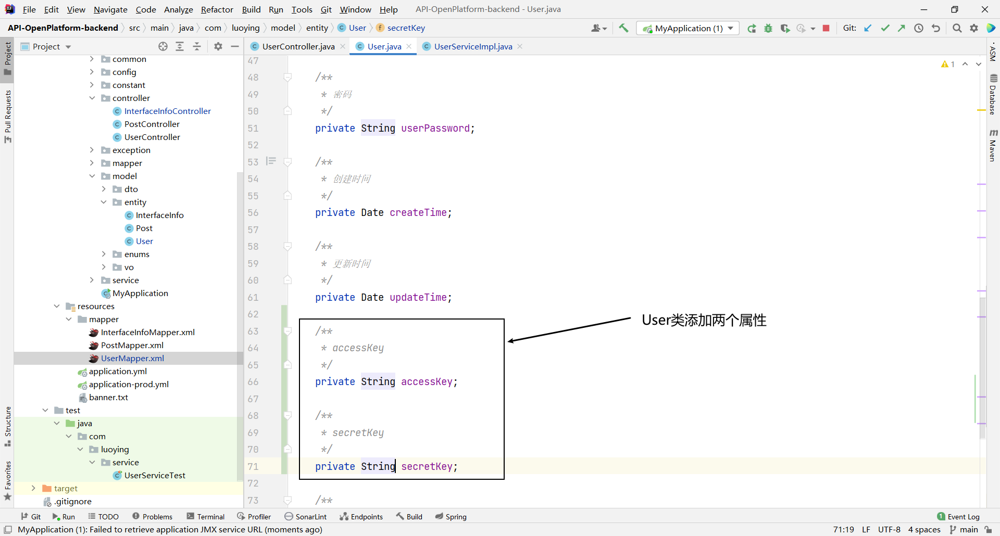**

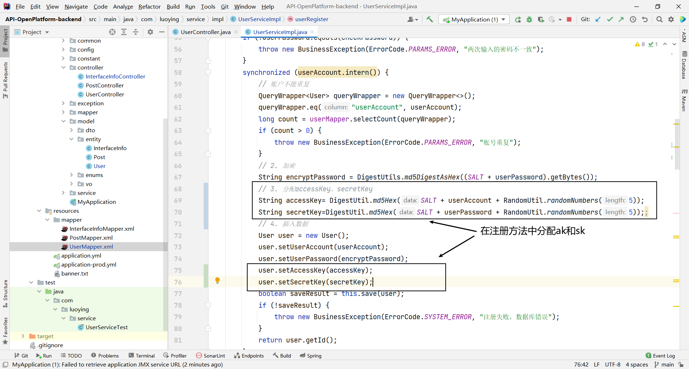

#### 在线调用

1. 前端将用户输入的请求参数和要测试的接口id发给接口管理平台后端
2. 调用前校验
3. 接口管理平台后端使用sdk客户端去调用模拟接口

```java
/**
 * 接口调用
 *
 * @param interfaceInfoInvokeRequest
 * @param request
 * @return
 */
@PostMapping("/invoke")
public BaseResponse<Object> invokeInterfaceInfo(@RequestBody InterfaceInfoInvokeRequest interfaceInfoInvokeRequest,
                                                 HttpServletRequest request) {
    // 参数校验
    if (interfaceInfoInvokeRequest == null || interfaceInfoInvokeRequest.getId() <= 0) {
        throw new BusinessException(ErrorCode.PARAMS_ERROR);
    }
    long id = interfaceInfoInvokeRequest.getId();
    String userRequestParams = interfaceInfoInvokeRequest.getUserRequestParams();
    // 判断接口是否存在
    InterfaceInfo oldInterfaceInfo = interfaceInfoService.getById(id);
    if (oldInterfaceInfo == null) {
        throw new BusinessException(ErrorCode.NOT_FOUND_ERROR);
    }
    //判断接口状态
    if (oldInterfaceInfo.getStatus().equals(InterfaceInfoStatusEnum.OFFLINE.getValue())) {
        throw new BusinessException(ErrorCode.PARAMS_ERROR,"接口未开放");
    }
    //判断该用户是否有签名
    User loginUser = userService.getLoginUser(request);
    String accessKey = loginUser.getAccessKey();
    String secretKey = loginUser.getSecretKey();
    LuoApiClient tempLuoApiClient = new LuoApiClient(accessKey, secretKey);
    Gson gson=new Gson();
    com.luoying.model.User user = gson.fromJson(userRequestParams, com.luoying.model.User.class);
    String result = tempLuoApiClient.getUsernameByPost(user);
    return ResultUtils.success(result);
}
```

#### 调用次数统计

**需求**：

1. 用户每次调用接口成功，次数加一
2. 系统为用户分配接口调用次数或用户申请接口调用次数

**业务流程**：

1. 用户调用接口
2. 修改数据库，调用次数

**设计库表**

用户调用接口关系表

```sql
create table user_interface_info
(
    id              bigint auto_increment comment '主键'
        primary key,
    userId          bigint                             not null comment '调用者Id',
    interfaceInfoId bigint                             not null comment '接口id',
    invokedNum      bigint                             not null comment '已调用次数',
    leftNum         bigint                             not null comment '剩余调用次数',
    status          tinyint  default 1                 not null comment '用户状态 0-限制 1-正常',
    createTime      datetime default CURRENT_TIMESTAMP not null comment '创建时间',
    updateTime      datetime default CURRENT_TIMESTAMP not null on update CURRENT_TIMESTAMP comment '更新时间',
    idDelete        tinyint  default 0                 not null comment '逻辑删除'

) comment '用户调用接口关系表';
```

**步骤：**

1. MybatisX生成增删改查代码

2. 开发基本增删改查代码（管理员使用）
3. 开发用户调用接口成功后，次数加一 （service)

```java
@Override
public boolean invokeCount(long interfaceInfoId, long userId) {
    if (interfaceInfoId <= 0 || userId <= 0){
        throw new BusinessException(ErrorCode.PARAMS_ERROR);
    }
    UpdateWrapper<UserInterfaceInfo> wrapper=new UpdateWrapper<>();
    wrapper.eq("interfaceInfoId",interfaceInfoId);
    wrapper.eq("userId",userId);
    wrapper.gt("leftNum",0);
    wrapper.setSql("leftNum = leftNum - 1 , invokedNum = invokedNum + 1");
    return this.update(wrapper);
}
```

### API网关

#### 网关是什么

例如：火车站的检票口。用户在检票口统一检票，通过就可以去自己的车厢，不需要每个车厢都配置一个检票员

#### 网关的作用

1. **路由**

网关会记录接口的信息，根据用户提供的地址和参数，转发用户的请求到对应的接口或者服务器

2. **统一鉴权**

无论用户访问何种接口，统一 判断用户是否有权限

3. **统一处理跨域**

网关统一处理跨域，不用每个项目单独重复处理跨域

```yml
#去除重复的响应头
spring:
  cloud:
    gateway:
      routes:
      - id: dedupe_response_header_route
        uri: https://example.org
        filters:
        - DedupeResponseHeader=Access-Control-Allow-Credentials Access-Control-Allow-Origin
```

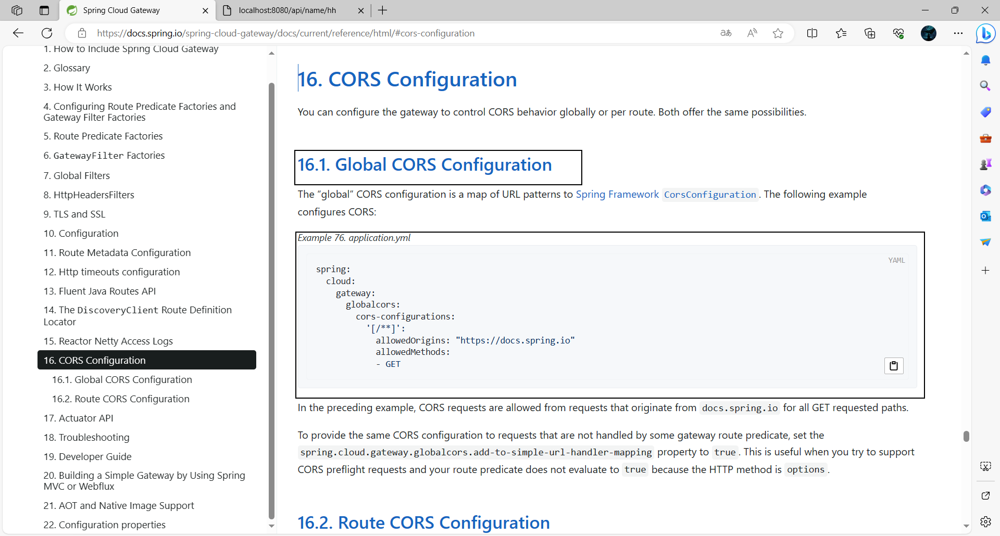

4. **统一业务处理**

把每个项目中相同的业务逻辑放到上层（网关）统一处理，比如本项目的接口调用次数统计

5. **访问控制**

设置黑白名单，例如：限制DDOS IP

```yml
spring:
  cloud:
    gateway:
      routes:
      - id: remoteaddr_route
        uri: https://example.org
        predicates:
        - RemoteAddr=192.168.1.1/24
      - id: xforwarded_remoteaddr_route
        uri: https://example.org
        predicates:
        - XForwardedRemoteAddr=192.168.1.1/24
```

6. **发布控制**

灰度发布。例如：上线升级后的接口，升级后的接口分配20%流量，升级前的接口分配80%的流量，随着接口的稳定，为升级后的接口分配更多的流量，直到100%

```yml
#10次请求中，8次访问weighthigh,2次访问weightlow
spring:
  cloud:
    gateway:
      routes:
      - id: weight_high
        uri: https://weighthigh.org
        predicates:
        - Weight=group1, 8
      - id: weight_low
        uri: https://weightlow.org
        predicates:
        - Weight=group1, 2
```

7. **流量染色**

网关给用户请求添加标识（特定请求头）

**全局路由染色**

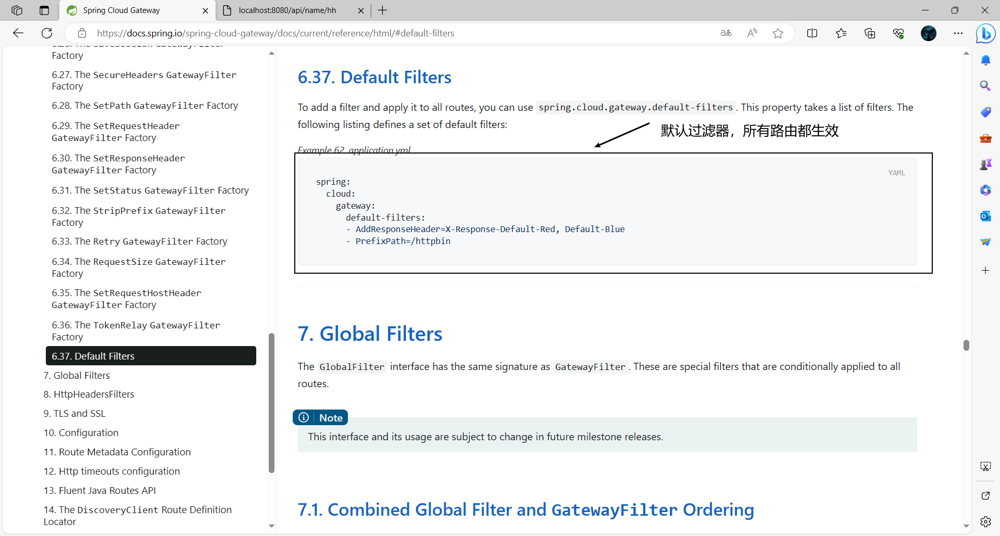

```yml
spring:
  cloud:
    gateway:
      default-filters:
        - AddRequestHeader=username, ranxu
        - PrefixPath=/httpbin
      routes:
        - id: path_route1
          uri: http://localhost:8002
          predicates:
            - Path=/api/name/**
```

**单路由染色**

```yml
spring:
  cloud:
    gateway:
      routes:
        - id: path_route1
          uri: http://localhost:8002
          predicates:
            - Path=/api/name/**
          filters:
            - AddRequestHeader=username, ranxu
            - AddRequestParameter=age, 18
```

8. **统一接口保护**

   1. 限制请求

   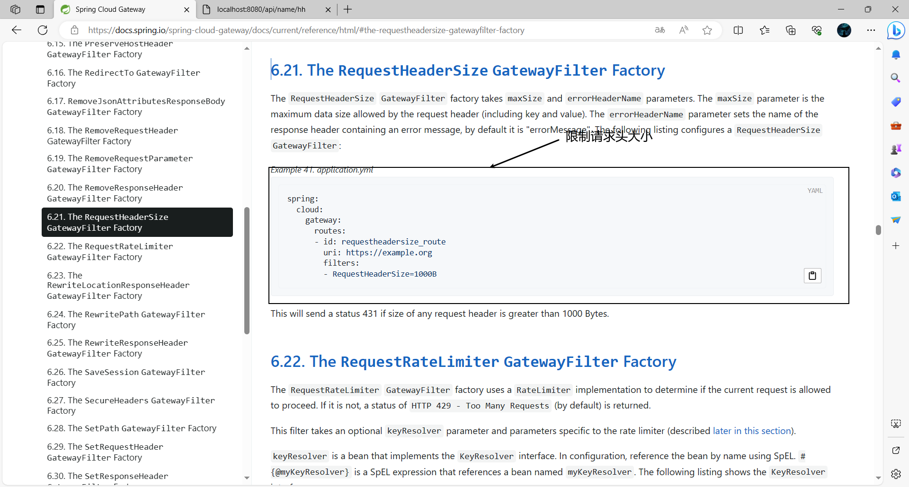

   1. 信息脱敏

   抹除响应中的ip信息

   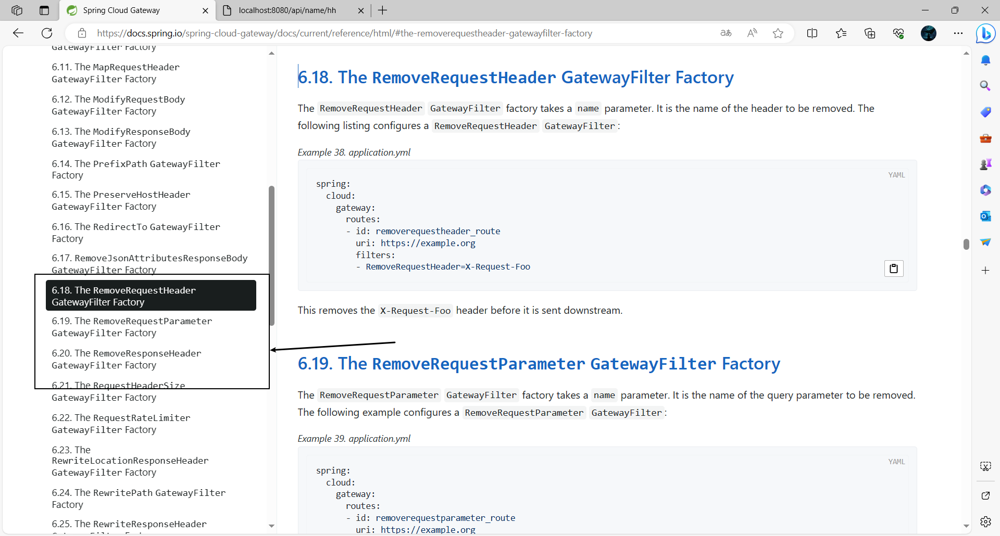

   3. 降级（熔断）

   服务停止，提供兜底方案，例如：提示用户该接口已下线，请访问其他可用接口

   

   ```
   <dependency>
       <groupId>org.springframework.cloud</groupId>
       <artifactId>spring-cloud-starter-circuitbreaker-reactor-resilience4j</artifactId>
   </dependency>
   ```

   ```yml
   spring:
     cloud:
       gateway:
         routes:
           - id: path_route1
             uri: http://localhost:8002
             predicates:
               - Path=/api/name/**
             filters:
               - AddRequestHeader=username, ranxu
               - AddRequestParameter=age, 18
               - name: CircuitBreaker
                 args:
                   name: myCircuitBreaker
                   fallbackUri: forward:/fallback
           - id: fallback
             uri: https://www.tencent.com
             predicates:
               - Path=/fallback
   ```

   4. 限流（学习令牌桶算法，漏桶算法，RedisLimiter）

   限制单位i时间的请求次数

   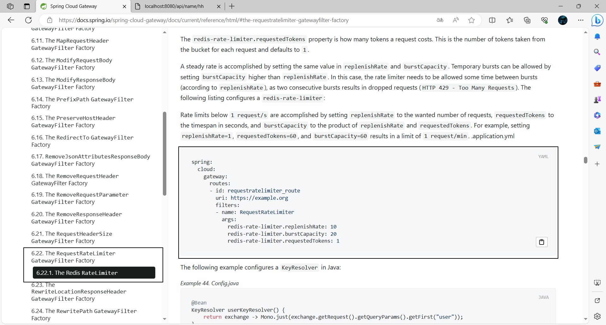

   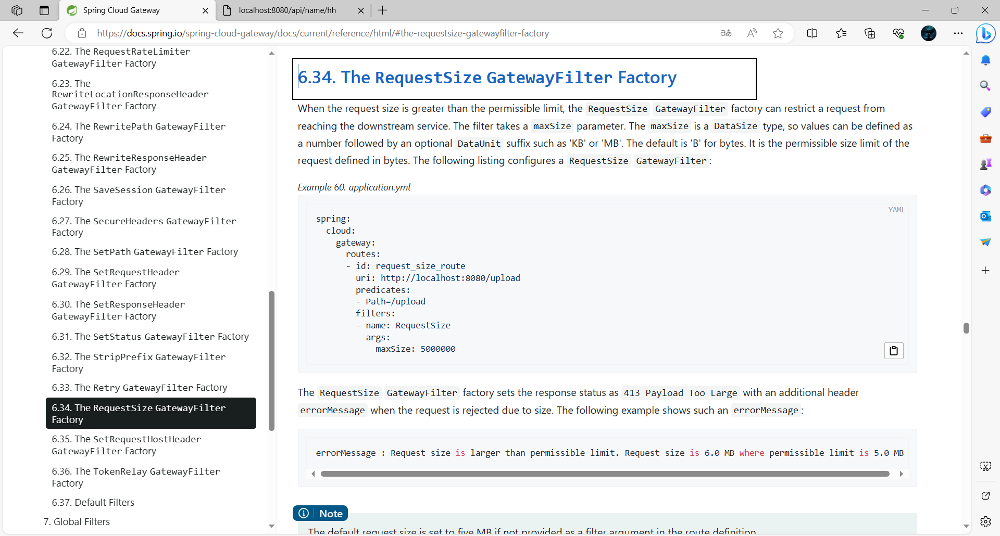

   5. 超时时间

   请求的最大处理时间，超过就强制中断

   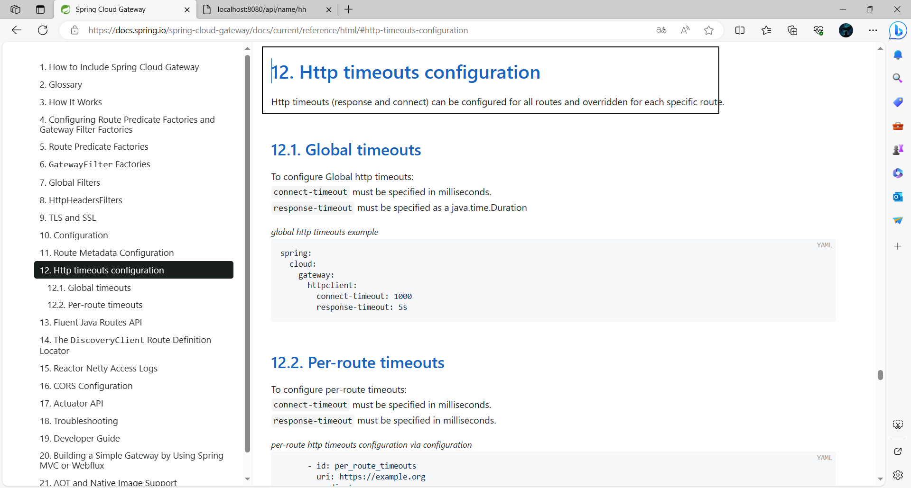

   6. 重试

   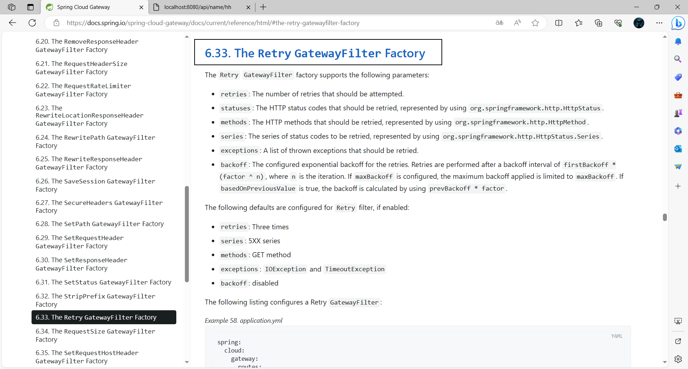

9. **统一日志**

统一记录请求和响应的信息

10. **统一文档**

把下游项目的文档聚合，在一个页面查看

[4.2 Cloud模式聚合OpenAPI文档 | knife4j (xiaominfo.com)](https://doc.xiaominfo.com/v2/action/aggregation-cloud.html)

11. **负载均衡**

    在路由的基础上，根据负载均衡策略，把请求转发到集群中的某台机器

    uri从固定地址改成 luoying.\*.\*

#### 网关的分类

1. **业务网关**（微服务网关：SPring Cloud Gateway）

作用：将请求转发到不同的业务 / 项目 / 接口 / 服务，有一些业务逻辑

2. **全局网关**（接入层网关：Nginx，Kong：https://github.com/Kong/kong）

作用：负载均衡，请求日志，不和业务逻辑绑定

参考文章：https://blog.csdn.net/qq_21040559/article/details/122961395

#### 网关的实现

网关技术选型：https://zhuanlan.zhihu.com/p/500587132

**SPring Cloud Gateway**：性能高，可以用Java代码来写逻辑，适合学习 

**官方文档**：https://docs.spring.io/spring-cloud-gateway/docs/current/reference/html/

**官方示例：**https://spring.io/projects/spring-cloud-gateway#samples 可以了解编程式配置网关

**核心概念：**

1. 路由：根据什么条件，转发请求到哪里
2. **断言**：一组规则，条件，确定如何转发路由

   1. After 在某个时间后
   2. Before 在某个时间前
   3. 请求头
   4. 请求方式
   5. 子域名
   6. 权重
   7. 路径
   8. 查询参数
   9. 客户端地址

3. **过滤器**：对请求进行一系列处理，例如添加请求头，请求参数

   1. 基本功能：对请求头，响应头，请求参数的增删改查

   2. 限制
   3. 重试
   4. 降级
   5. 默认

**请求流程：**

1. 客户端发起请求
2. Handler Mapping：根据断言，将请求转发到对应的路由 
3. Web Handler：处理请求（过滤器层层过滤）
4. 实际调用服务

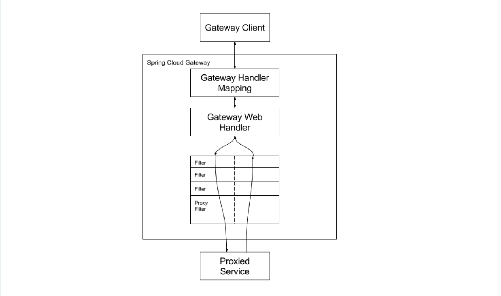

**两种引入方式：**

1. 配置式（方便，规范）


```yml
#建议开启路由映射日志
logging:
  level:
    org:
      springframework:
        cloud:
          gateway: trace
```

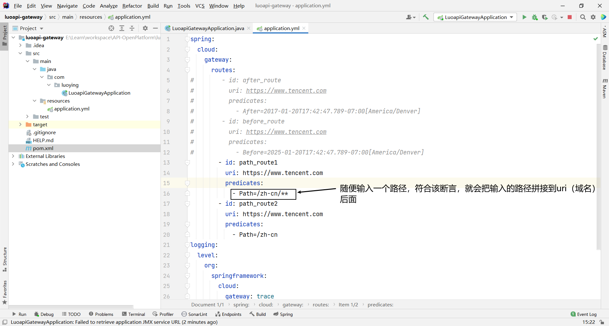

2. 编程式（灵活，相对麻烦）

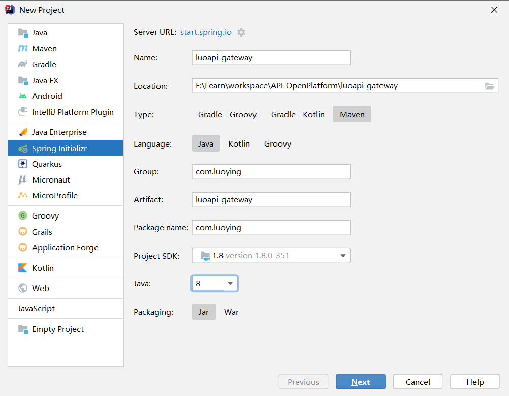

 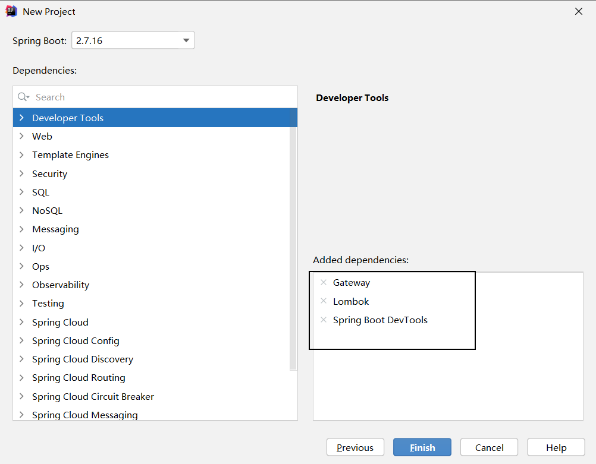

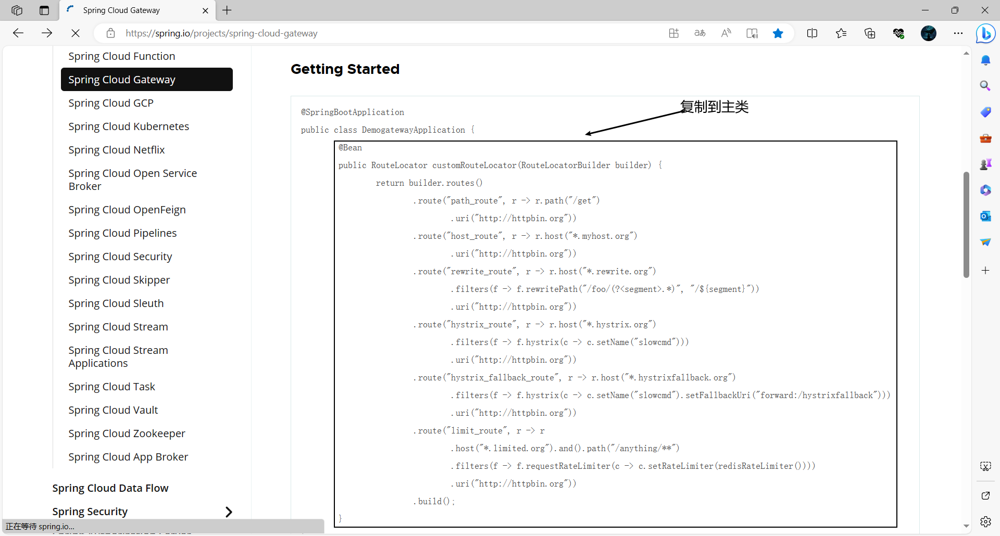

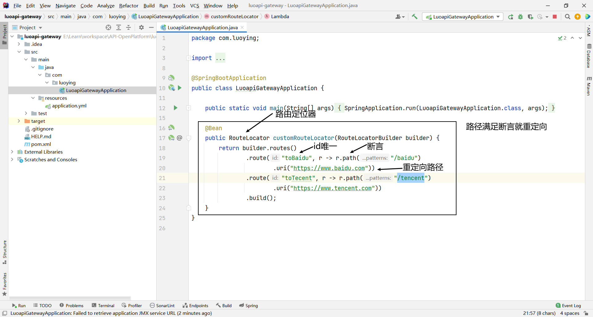

### 结合业务应用网关

#### **所用特性**

1. 路由（网关转发请求到模拟接口）

2. 统一用户鉴权

3. 统一业务处理（接口调用次数统计）

4. 访问控制（设置黑白名单）

5. 流量染色（辨别请求是否经过网关）

6. 统一日志（记录每次的请求和响应）

#### **业务逻辑**

1. 用户发送请求到API网关
2. 记录请求日志
3. 黑白名单
4. 用户鉴权（判断ak和sk是否合法）
5. 请求的模拟接口是否存在
6. 请求转发，调用模拟接口
7. 调用成功，接口调用次数加一
8. 调用失败，返回一个规范的错误码
9. 记录响应日志

#### 具体实现

1. **请求转发**

使用`Path` Route Predicate

匹配所有路径为：/api/xxx的请求，转发到localhost:8002/api/xxx

例如请求网关 localhost:8012/api/name/hh 转发到 localhost:8002/api/name/hh

```yml
spring:
  cloud:
    gateway:
      routes:
        - id: api_route
          uri: http://localhost:8002
          predicates:
            - Path=/api/**
      default-filters:
        - AddRequestHeader=username,ranxu
```

2. **编写业务逻辑**

使用GlobalFilter，全局请求拦截处理

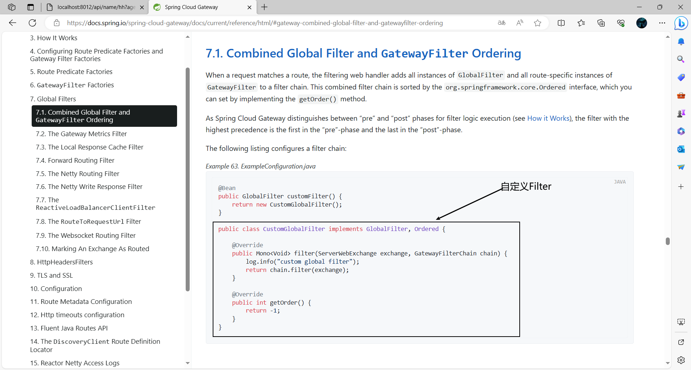

因为网关项目没引入Mybatis等操作数据库的类库，无法直接进行增删改查操作，可以由back-end项目提供增删改查接口，然后远程调用back-end项目中的接口，不用重复写逻辑

方法：

1. HTTP 请求 （HTTPClient、RestTemplate、Feign ）
2. RPC（Dubbo）

**问题：**

预期是模拟接口调用完成，才记录响应日志，统计调用次数

实际上chain.filter是异步方法，直到filter过滤器返回后，才调用了模拟接口。导致响应日志，统计调用次数在调用模拟接口之前执行

**解决方案：**

利用response装饰者，增强原有response的处理能力

参考文章：https://blog.csdn.net/qq_19636353/article/details/126759522

其他文章：

```java
/**
 * 全局过滤
 */
@Slf4j
@Component
public class CustomGlobalFilter implements GlobalFilter, Ordered {
    private static final List<String> IP_WHITE_LIST = Arrays.asList("127.0.0.1");

    @Override
    public Mono<Void> filter(ServerWebExchange exchange, GatewayFilterChain chain) {
        // 1. 记录请求日志
        ServerHttpRequest request = exchange.getRequest();
        log.info("请求唯一标识：{}", request.getId());
        log.info("请求路径：{}", request.getPath().value());
        log.info("请求方法：{}", request.getMethod());
        log.info("请求参数：{}", request.getQueryParams());
        log.info("请求地址来源：{}", request.getRemoteAddress());
        String sourceAddress = request.getLocalAddress().getHostString();
        log.info("请求地址来源：{}", sourceAddress);
        // 2. 黑白名单
        ServerHttpResponse response = exchange.getResponse();
        if (!IP_WHITE_LIST.contains(sourceAddress)) {
            response.setStatusCode(HttpStatus.FORBIDDEN);
            return response.setComplete();
        }
        // 3. 用户鉴权（判断ak和sk是否合法）
        HttpHeaders headers = request.getHeaders();
        String accessKey = headers.getFirst("accessKey");
        String sign = headers.getFirst("sign");
        String body = headers.getFirst("body");
        String timestamp = headers.getFirst("timestamp");
        Date timestamp1 = new Date(Long.valueOf(timestamp).longValue());
        //todo 根据accessKey查询数据库，是否存在包含改accessKey的记录
        if (!"ranxu".equals(accessKey)) {
            return handleNoAuth(response);
        }
        //过期时间不能在当前时间之前
        if (timestamp1.before(new Date())) {
            return handleNoAuth(response);
        }
        // todo 根据记录获取secretKey
        String dbSign = SignUtil.genSign(body, "abc");
        if (!dbSign.equals(sign)) {
            return handleNoAuth(response);
        }
        //todo 从数据库中查询接口是否存在，请求方法是否匹配（请求参数是否合法）
        // 4. 请求的模拟接口是否存在

        // 5. 请求转发，调用模拟接口
        return responseLog(exchange,chain);
    }

    @Override
    public int getOrder() {
        return -1;
    }

    public Mono<Void> handleNoAuth(ServerHttpResponse response) {
        response.setStatusCode(HttpStatus.FORBIDDEN);
        return response.setComplete();
    }

    public Mono<Void> handlInvokeError(ServerHttpResponse response) {
        response.setStatusCode(HttpStatus.INTERNAL_SERVER_ERROR);
        return response.setComplete();
    }

    public Mono<Void> responseLog(ServerWebExchange exchange, GatewayFilterChain chain) {
        try {
            ServerHttpResponse originalResponse = exchange.getResponse();
            // 缓冲区工厂缓存数据
            DataBufferFactory bufferFactory = originalResponse.bufferFactory();
            // 获取响应码
            HttpStatus statusCode = originalResponse.getStatusCode();

            if (statusCode == HttpStatus.OK) {
                // 获取装饰后的Response，增强能力
                ServerHttpResponseDecorator decoratedResponse = new ServerHttpResponseDecorator(originalResponse) {

                    @Override
                    public Mono<Void> writeWith(Publisher<? extends DataBuffer> body) {
                        log.info("body instanceof Flux: {}", (body instanceof Flux));
                        if (body instanceof Flux) {
                            Flux<? extends DataBuffer> fluxBody = Flux.from(body);
                            // 等模拟接口调用完成后，才会执行
                            return super.writeWith(fluxBody.map(dataBuffer -> {
                                // 6. todo 调用成功，接口调用次数加一
                                if (originalResponse.getStatusCode() == HttpStatus.OK) {

                                } else {
                                    // 7. 调用失败，返回一个规范的错误码

                                }
                                //content就是模拟接口的返回值
                                byte[] content = new byte[dataBuffer.readableByteCount()];
                                dataBuffer.read(content);
                                DataBufferUtils.release(dataBuffer);//释放掉内存
                                // 构建日志
                                StringBuilder sb2 = new StringBuilder(200);
                                sb2.append("<--- {} {} \n");
                                List<Object> rspArgs = new ArrayList<>();
                                rspArgs.add(originalResponse.getStatusCode());
                                //rspArgs.add(requestUrl);
                                String data = new String(content, StandardCharsets.UTF_8);//data
                                sb2.append(data);
                                // 8. 记录响应日志
                                log.info("响应结果：{}",data);
                                return bufferFactory.wrap(content);
                            }));
                        } else {
                            log.error("<--- {} 响应code异常", getStatusCode());
                        }
                        return super.writeWith(body);
                    }
                };
                //放行调用模拟接口并设置 response 对象为装饰后的，调用完模拟接口就会拼接字符串
                return chain.filter(exchange.mutate().response(decoratedResponse).build());
            }
            return chain.filter(exchange);//降级处理返回数据
        } catch (Exception e) {
            log.error("网关处理响应异常" + e);
            return chain.filter(exchange);
        }
    }
}
```

#### RPC运用

**问题**：

1. 网关项目比较纯净，未引入操作数据库的包
2. 需要调用其他项目的代码，直接复制粘贴会导致后期修改维护很麻烦

**理想：**

直接请求到其他项目的方法

**如何调用其他项目的方法？**

1. 复制粘贴代码，依赖，环境
2. HTTP 请求 （在源项目中提供接口）
3. RPC
4. 打包公共的代码

**HTTP 请求怎么调用：**

1. 提供方开发一个接口（地址，参数，请求方法，返回值）
2. 调用方使用HTTP Ckient之类的代码包去发送

**RPC：**

作用：像调用本地方法一样调用远程方法

优点：

1. 对开发者更透明，减少了沟通成本

2. RPC 向远程服务器发送请求时，未必要使用HTTP协议，比如还可以用TCP/IP，性能更高（更实用于调用内部服务）

**RPC调用模型：**

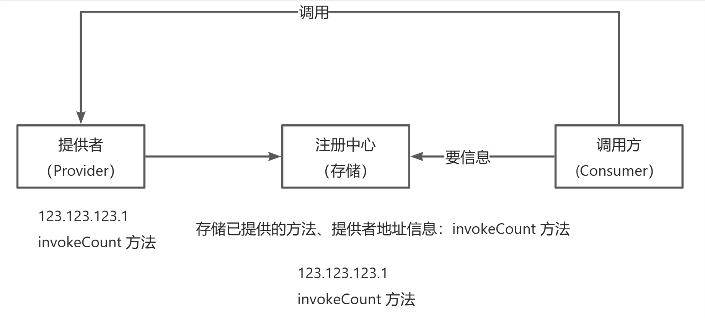

**RPC实现（Dubbo框架）：**

其他 RPC 框架：GRPC、TRPC

官方文档：https://cn.dubbo.apache.org/zh-cn/overview/mannual/java-sdk/quick-start/spring-boot/


**整合运用：**

1. backend项目作为服务提供者

2. gateway项目作为服务调用者

**整合nacos和dubbo：**

[Nacos | Apache Dubbo](https://cn.dubbo.apache.org/zh-cn/overview/mannual/java-sdk/reference-manual/registry/nacos/)

1. 安装nacos-server，版本2.1.1

2. 启动nacos

```sh
startup.cmd -m standalone
```

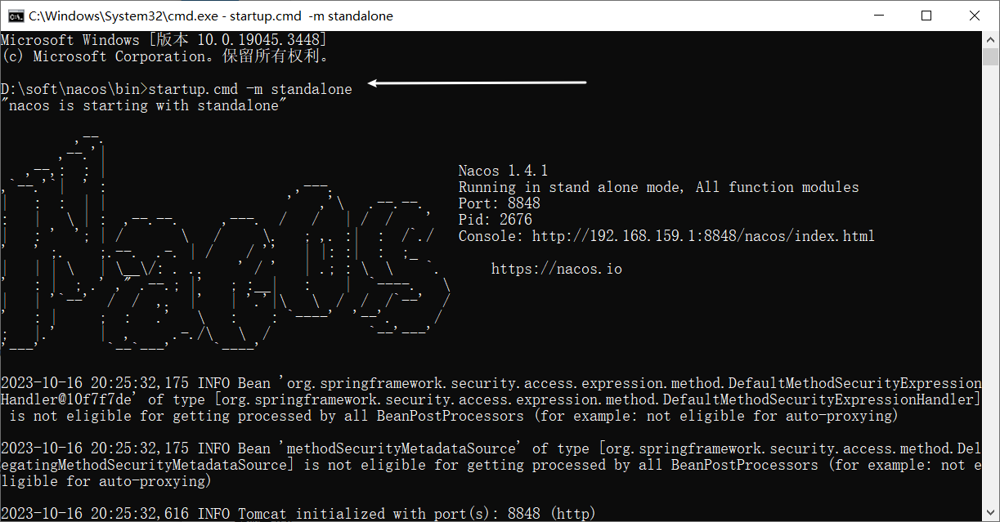

3. 引入依赖

```xml
<!-- Dubbo 3.0.0 及以上版本需 nacos-client 2.0.0 及以上版本 -->
<dependency>
    <groupId>org.apache.dubbo</groupId>
    <artifactId>dubbo</artifactId>
    <version>3.0.9</version>
</dependency>
<dependency>
    <groupId>com.alibaba.nacos</groupId>
    <artifactId>nacos-client</artifactId>
    <version>2.1.0</version>
</dependency>
```


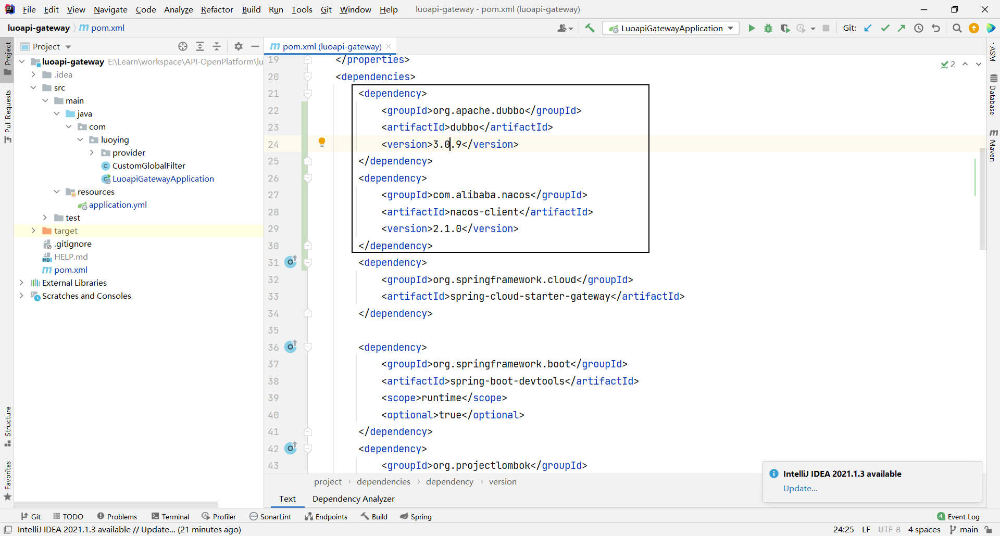

4. 配置并启用 Nacos

```yml
# application.yml (Spring Boot)
dubbo:
  application:
    name: dubbo-springboot-demo-provider
  protocol:
    name: dubbo
    port: -1
  registry:
    id: nacos-registry
    address: nacos://localhost:8848
```

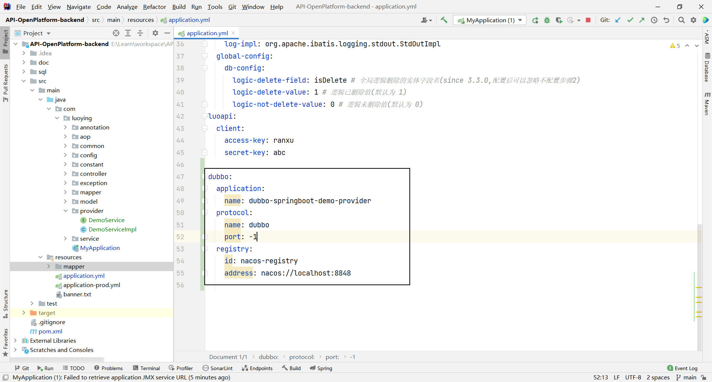

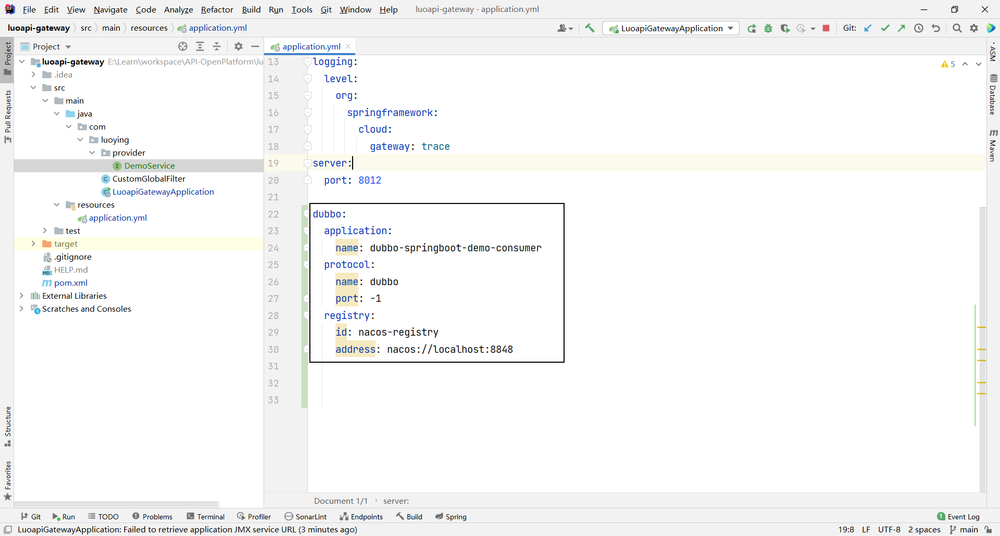

5. 主类设置@EnableDubbo注解

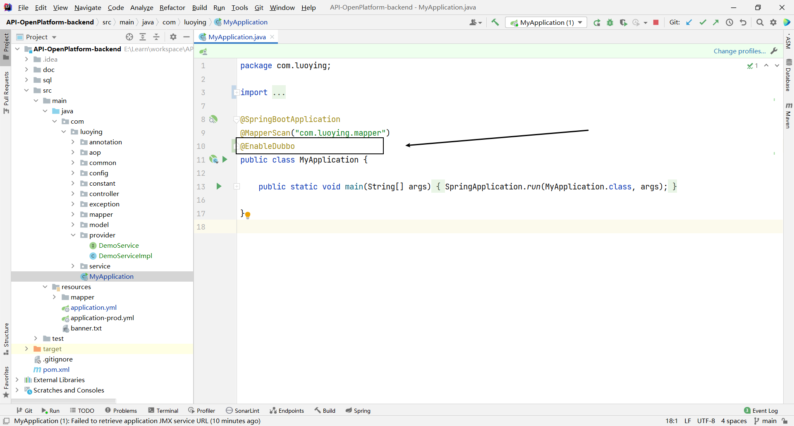

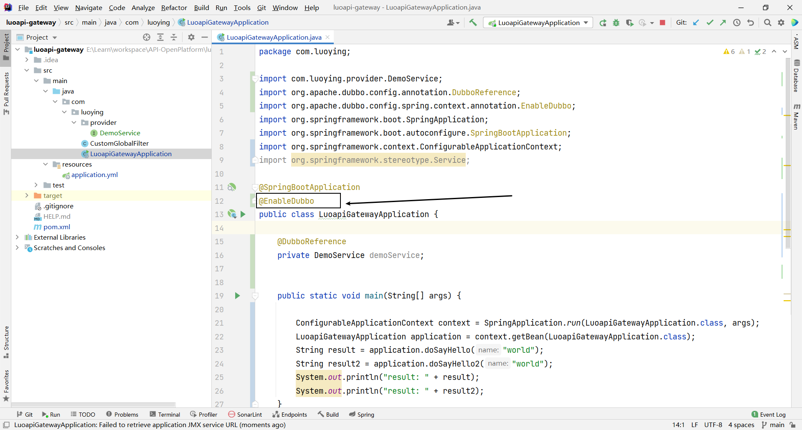

6. backend项目提供服务

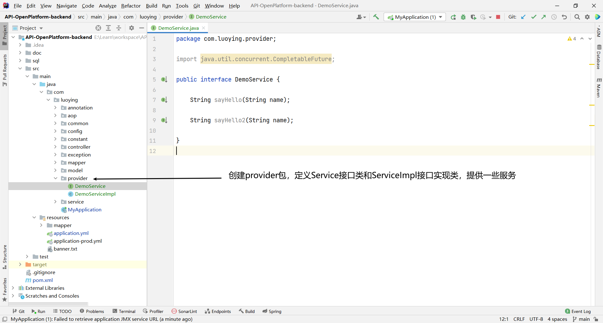

```java
public interface DemoService {

    String sayHello(String name);

    String sayHello2(String name);

}
```

```java
@DubboService
public class DemoServiceImpl implements DemoService {

    @Override
    public String sayHello(String name) {
        System.out.println("Hello " + name + ", request from consumer: " + RpcContext.getContext().getRemoteAddress());
        return "Hello " + name;
    }


    @Override
    public String sayHello2(String name) {
        return "ranxu";
    }
    
}
```

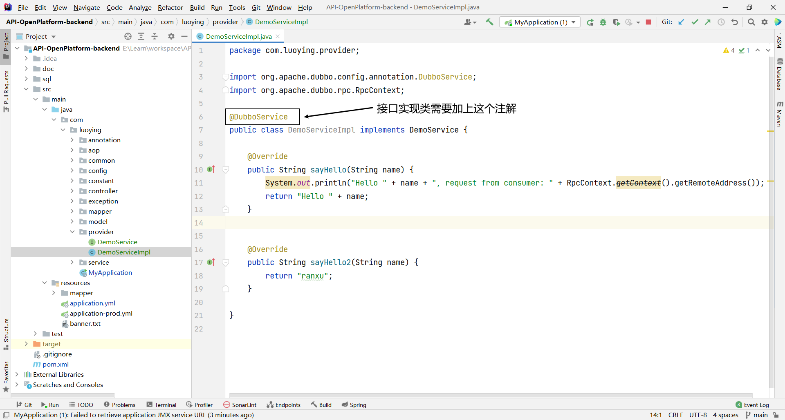

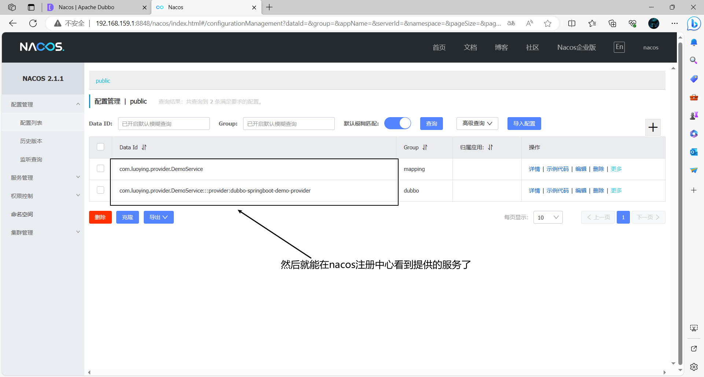

7. gateway项目消费服务

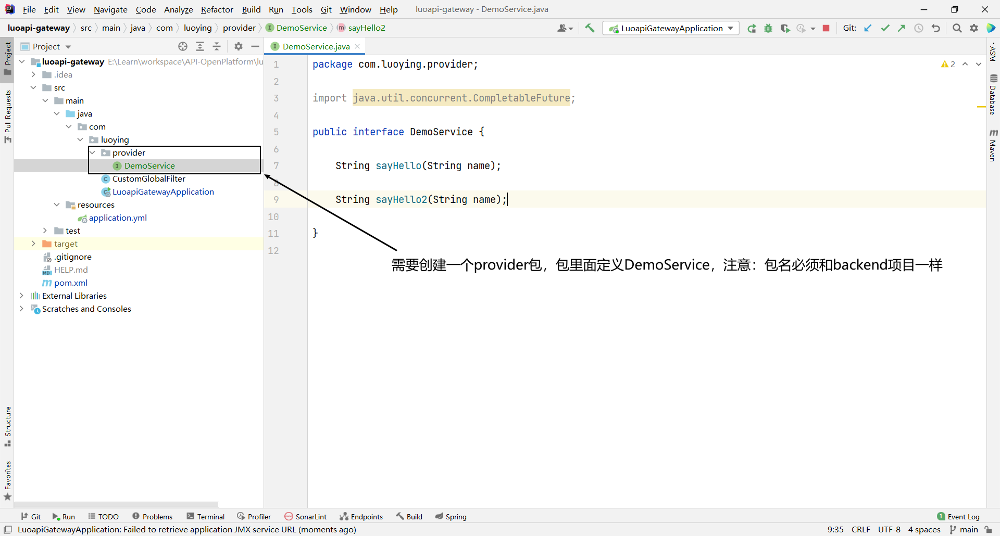

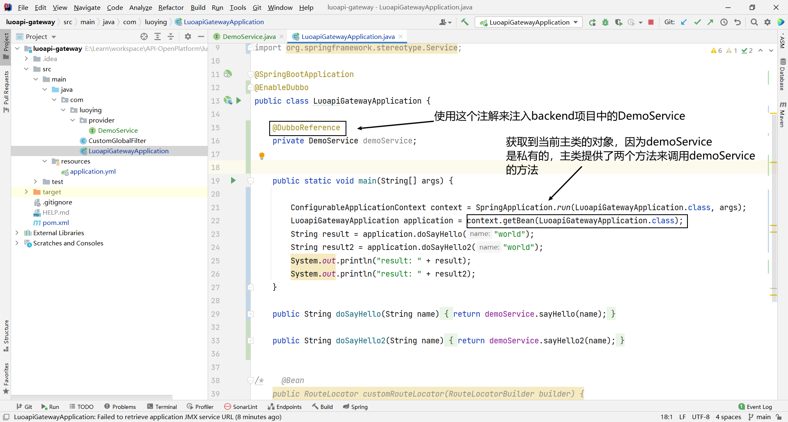

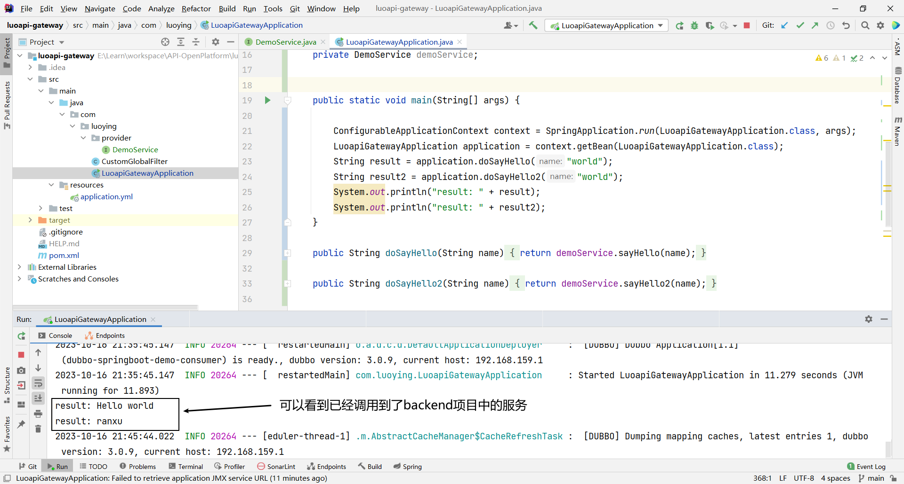

#### 完整网关的业务逻辑

**公共服务：**

目的是让方法，实体类在多个项目复用

1. 根据accessKey查询数据库，是否存在包含该accessKey的用户
2. 从数据库中查询接口是否存在（请求方法，请求路径）
3. 调用成功，接口调用次数加一（userId，interfaceInfoId）

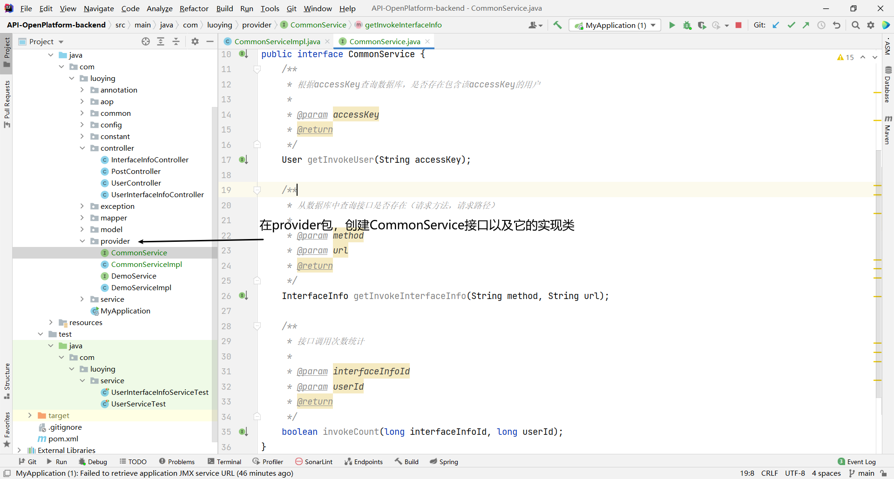

```java
public interface CommonService {
    /**
     * 根据accessKey查询数据库，是否存在包含该accessKey的用户
     *
     * @param accessKey
     * @return
     */
    User getInvokeUser(String accessKey);

    /**
     * 从数据库中查询接口是否存在（请求方法，请求路径）
     *
     * @param method
     * @param url
     * @return
     */
    InterfaceInfo getInvokeInterfaceInfo(String method, String url);

    /**
     * 接口调用次数统计
     *
     * @param interfaceInfoId
     * @param userId
     * @return
     */
    boolean invokeCount(long interfaceInfoId, long userId);
}
```

```java
@DubboService
public class CommonServiceImpl implements CommonService {

    @Resource
    private UserMapper userMapper;

    @Resource
    private UserInterfaceInfoMapper userInterfaceInfoMapper;

    @Resource
    private InterfaceInfoMapper interfaceInfoMapper;

    @Override
    public User getInvokeUser(String accessKey) {
        if (StringUtils.isBlank(accessKey)){
            throw new BusinessException(ErrorCode.PARAMS_ERROR);
        }
        QueryWrapper<User> wrapper = new QueryWrapper<>();
        wrapper.eq("accessKey", accessKey);
        User user = userMapper.selectOne(wrapper);
        if (user == null){
            throw new BusinessException(ErrorCode.SYSTEM_ERROR,"用户不存在");
        }
        return user;
    }

    @Override
    public InterfaceInfo getInvokeInterfaceInfo(String method, String url) {
        if (StringUtils.isAnyBlank(method,url)){
            throw new BusinessException(ErrorCode.PARAMS_ERROR);
        }
        QueryWrapper<InterfaceInfo> wrapper = new QueryWrapper<>();
        wrapper.eq("method", method);
        wrapper.eq("url", url);
        InterfaceInfo interfaceInfo = interfaceInfoMapper.selectOne(wrapper);
        if (interfaceInfo == null){
            throw new BusinessException(ErrorCode.SYSTEM_ERROR,"接口不存在");
        }
        return interfaceInfo;
    }

    @Override
    public boolean invokeCount(long interfaceInfoId, long userId) {
        if (interfaceInfoId <= 0 || userId <= 0) {
            throw new BusinessException(ErrorCode.PARAMS_ERROR);
        }
        QueryWrapper<UserInterfaceInfo> wrapper = new QueryWrapper<>();
        wrapper.eq("interfaceInfoId", interfaceInfoId);
        wrapper.eq("userId", userId);
        wrapper.gt("leftNum", 0);
        UserInterfaceInfo userInterfaceInfo = userInterfaceInfoMapper.selectOne(wrapper);

        if (userInterfaceInfo == null) {
            throw new BusinessException(ErrorCode.SYSTEM_ERROR,"无可用次数");
        }
        userInterfaceInfo.setLeftNum(userInterfaceInfo.getLeftNum() - 1);
        userInterfaceInfo.setInvokedNum(userInterfaceInfo.getInvokedNum() + 1);

        if (userInterfaceInfoMapper.updateById(userInterfaceInfo) <1) {
            throw new BusinessException(ErrorCode.SYSTEM_ERROR,"无可用次数");
        }
        return true;
    }
}
```

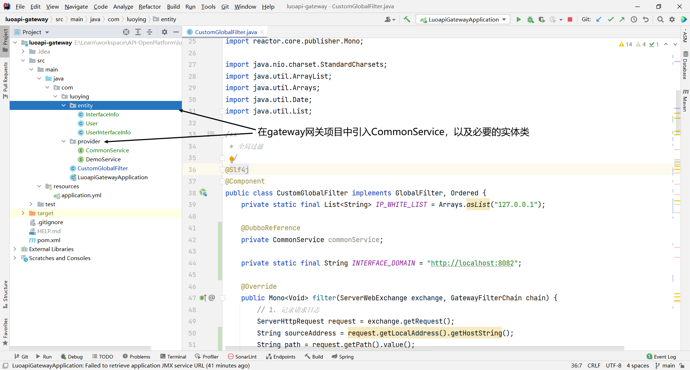

```java
/**
 * 全局过滤
 */
@Slf4j
@Component
public class CustomGlobalFilter implements GlobalFilter, Ordered {
    private static final List<String> IP_WHITE_LIST = Arrays.asList("127.0.0.1");
    @DubboReference
    private CommonService commonService;
    private static final String INTERFACE_DOMAIN = "http://localhost:8082";
    @Override
    public Mono<Void> filter(ServerWebExchange exchange, GatewayFilterChain chain) {
        // 1. 记录请求日志
        ServerHttpRequest request = exchange.getRequest();
        String sourceAddress = request.getLocalAddress().getHostString();
        String path = request.getPath().value();
        String method = request.getMethod().toString();
        log.info("请求唯一标识：{}", request.getId());
        log.info("请求路径：{}", path);
        log.info("请求方法：{}", method);
        log.info("请求参数：{}", request.getQueryParams());
        log.info("请求地址来源：{}", request.getRemoteAddress());
        log.info("请求地址来源：{}", sourceAddress);
        // 2. 黑白名单
        ServerHttpResponse response = exchange.getResponse();
        if (!IP_WHITE_LIST.contains(sourceAddress)) {
            response.setStatusCode(HttpStatus.FORBIDDEN);
            return response.setComplete();
        }
        // 3. 用户鉴权（判断ak和sk是否合法）
        HttpHeaders headers = request.getHeaders();
        String accessKey = headers.getFirst("accessKey");
        String sign = headers.getFirst("sign");
        String body = headers.getFirst("body");
        String timestamp = headers.getFirst("timestamp");
        Date timestamp1 = new Date(Long.valueOf(timestamp).longValue());
        //根据accessKey查询数据库，是否存在包含该accessKey的用户
        User invokeUser = null;
        try {
            invokeUser = commonService.getInvokeUser(accessKey);
        } catch (Exception e) {
            log.error("getInvokeUser error", e);
            return handleNoAuth(response);
        }
        //过期时间不能在当前时间之前
        if (timestamp1.before(new Date())) {
            return handleNoAuth(response);
        }
        //根据记录获取secretKey
        String secretKey = invokeUser.getSecretKey();
        String dbSign = SignUtil.genSign(body, secretKey);
        if (!dbSign.equals(sign)) {
            return handleNoAuth(response);
        }
        // 4. 请求的模拟接口是否存在
        InterfaceInfo invokeInterfaceInfo = null;
        try {
            invokeInterfaceInfo = commonService.getInvokeInterfaceInfo(method, INTERFACE_DOMAIN + path);
        } catch (Exception e) {
            log.error("getInvokeInterfaceInfo error", e);
            return handlInvokeError(response);
        }
        Long interfaceInfoId = invokeInterfaceInfo.getId();
        Long userId = invokeUser.getId();
        // 5. 请求转发，调用模拟接口
        return responseLog(exchange, chain, interfaceInfoId, userId);
    }
    @Override
    public int getOrder() {
        return -1;
    }
    public Mono<Void> handleNoAuth(ServerHttpResponse response) {
        response.setStatusCode(HttpStatus.FORBIDDEN);
        return response.setComplete();
    }
    public Mono<Void> handlInvokeError(ServerHttpResponse response) {
        response.setStatusCode(HttpStatus.INTERNAL_SERVER_ERROR);
        return response.setComplete();
    }
    public Mono<Void> responseLog(ServerWebExchange exchange, GatewayFilterChain chain, long interfaceInfoId, long userId) {
        try {
            ServerHttpResponse originalResponse = exchange.getResponse();
            // 缓冲区工厂缓存数据
            DataBufferFactory bufferFactory = originalResponse.bufferFactory();
            // 获取响应码
            HttpStatus statusCode = originalResponse.getStatusCode();
            if (statusCode == HttpStatus.OK) {
                // 获取装饰后的Response，增强能力
                ServerHttpResponseDecorator decoratedResponse = new ServerHttpResponseDecorator(originalResponse) {
                    @Override
                    public Mono<Void> writeWith(Publisher<? extends DataBuffer> body) {
                        log.info("body instanceof Flux: {}", (body instanceof Flux));
                        if (body instanceof Flux) {
                            Flux<? extends DataBuffer> fluxBody = Flux.from(body);
                            // 等模拟接口调用完成后，才会执行
                            return super.writeWith(fluxBody.map(dataBuffer -> {
                                // 6. 调用成功，接口调用次数加一
                                try {
                                    commonService.invokeCount(interfaceInfoId, userId);
                                } catch (Exception e) {
                                    log.error("invokeCount error",e);
                                }
                                //content就是模拟接口的返回值
                                byte[] content = new byte[dataBuffer.readableByteCount()];
                                dataBuffer.read(content);
                                DataBufferUtils.release(dataBuffer);//释放掉内存
                                // 构建日志
                                StringBuilder sb2 = new StringBuilder(200);
                                sb2.append("<--- {} {} \n");
                                List<Object> rspArgs = new ArrayList<>();
                                rspArgs.add(originalResponse.getStatusCode());
                                //rspArgs.add(requestUrl);
                                String data = new String(content, StandardCharsets.UTF_8);//data
                                sb2.append(data);
                                // 8. 记录响应日志
                                log.info("响应结果：{}", data);
                                return bufferFactory.wrap(content);
                            }));
                        } else {
                            log.error("<--- {} 响应code异常", getStatusCode());
                        }
                        return super.writeWith(body);
                    }
                };
                //放行调用模拟接口并设置 response 对象为装饰后的，调用完模拟接口就会拼接字符串
                return chain.filter(exchange.mutate().response(decoratedResponse).build());
            }
            return chain.filter(exchange);//降级处理返回数据
        } catch (Exception e) {
            log.error("网关处理响应异常" + e);
            return chain.filter(exchange);
        }
    }
}
```

## 前端

### 基础功能

#### 前端配置代码美化插件

1. 配置代码规范美化插件，方便快速格式化 


#### 自动生成后端请求代码

使用前端Ant Design Pro框架集成的openapi插件生成向后端发请求的代码（该插件依赖后端遵循openapi规范的swagger文档）


#### 修改requestErrorConfig


#### 测试登录接口


#### 管理员查看接口


#### 修改路由


#### 整体页面风格设置


#### 管理员创建接口


#### 管理员更新接口


#### 管理员删除接口


### 接口调用

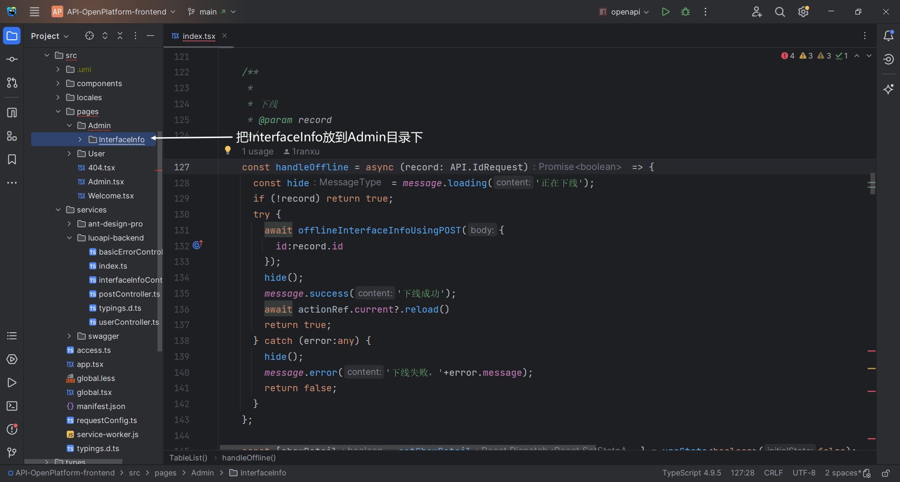


#### 管理员发布/下线接口

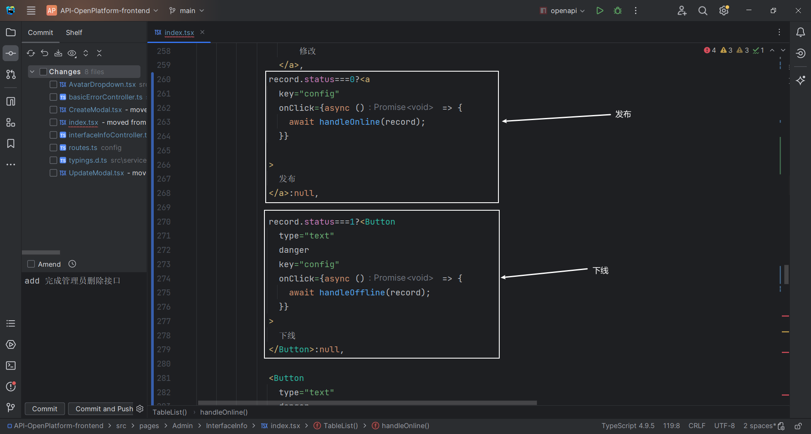

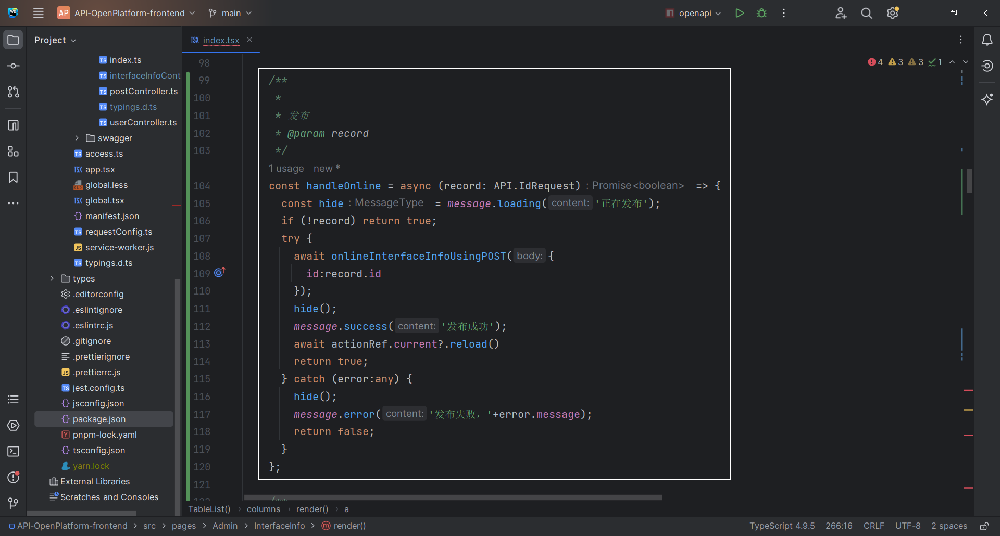

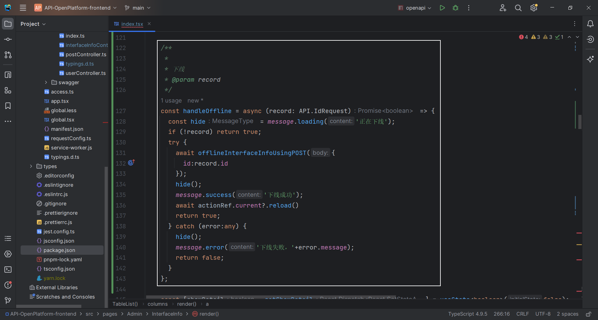

#### 用户浏览接口

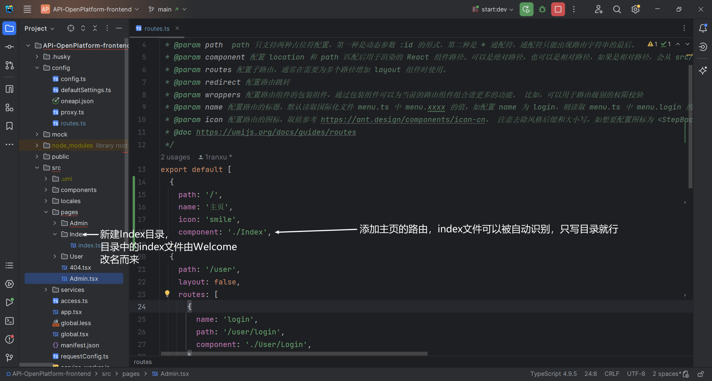

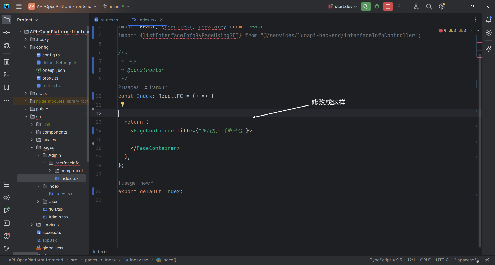

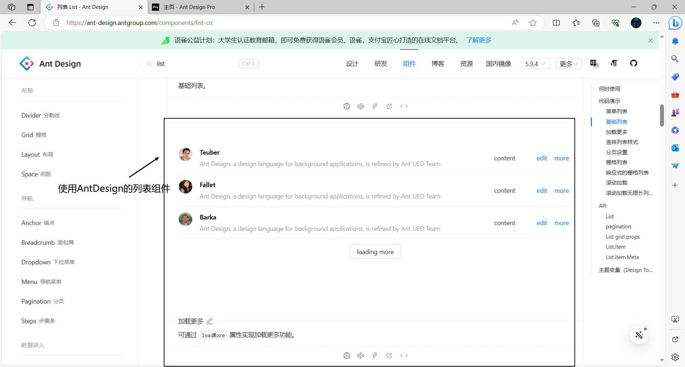

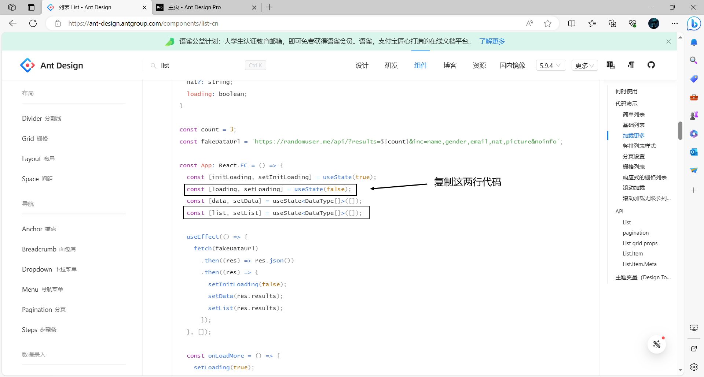

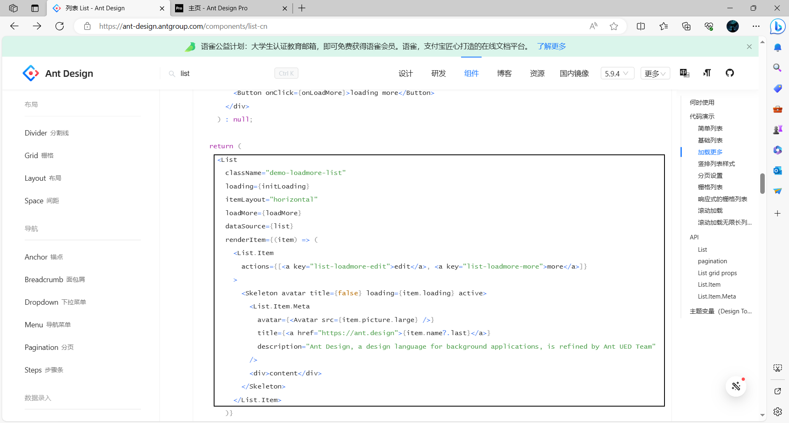

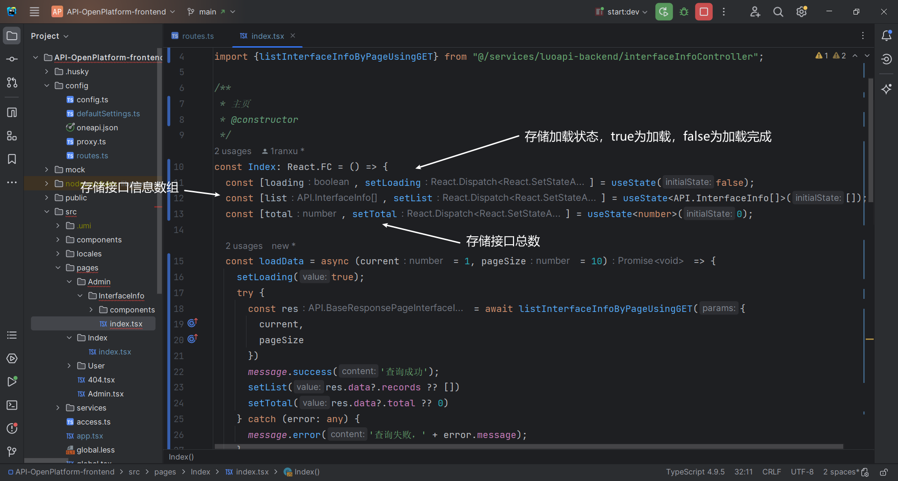


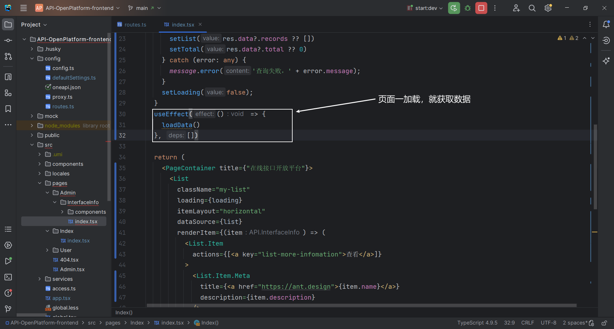

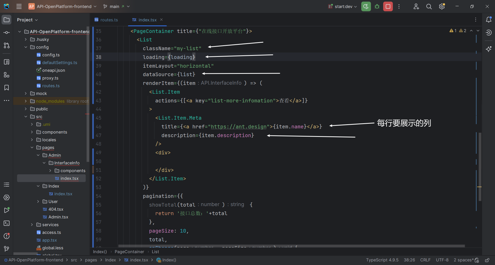


#### 用户查看接口文档


#### 在线调用


## todo

1. 判断该接口是否可以调用，固定方法名改为根据测试地址来调用

2. 用户调用接口，固定方法名改为根据测试地址来调用

3. 模拟接口改为从数据库校验ak和sk

4. 用户可以申请更换签名

5. 把sdk上传到maven仓库

6. 接口预警

   
