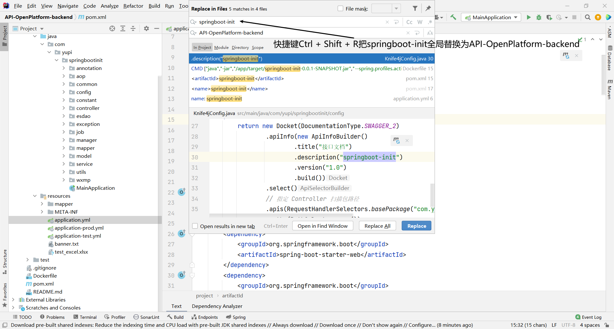
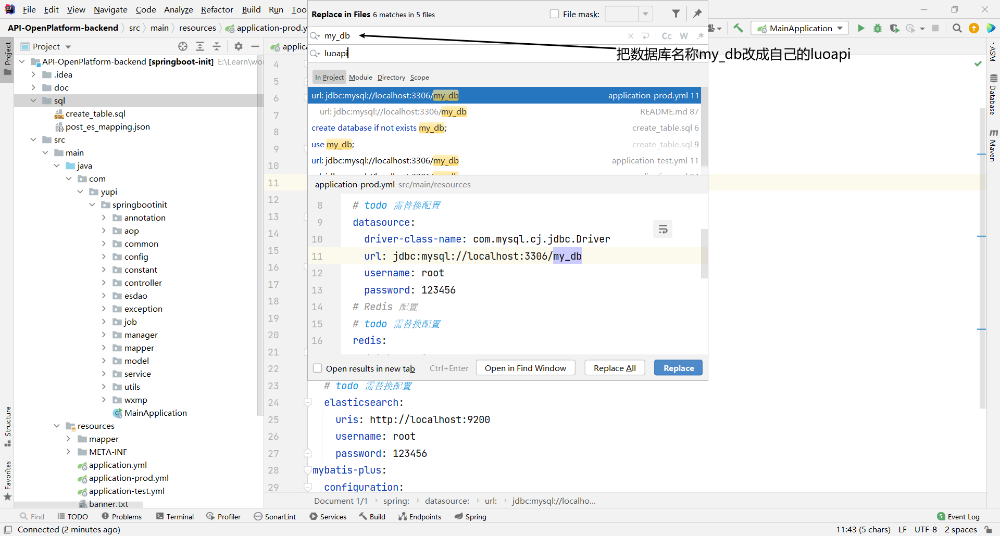
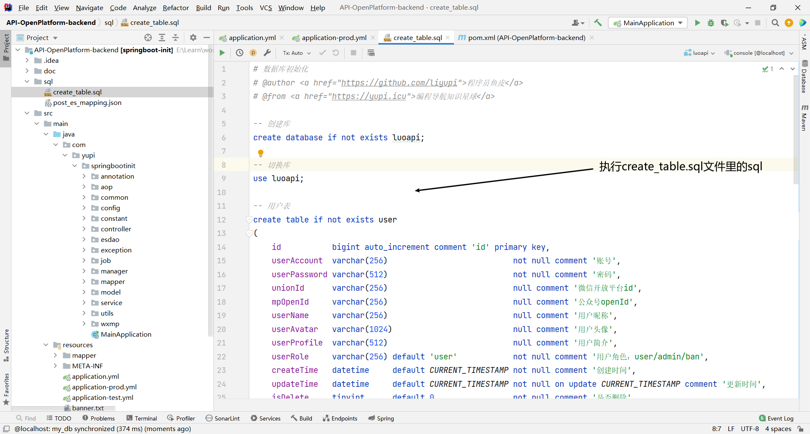
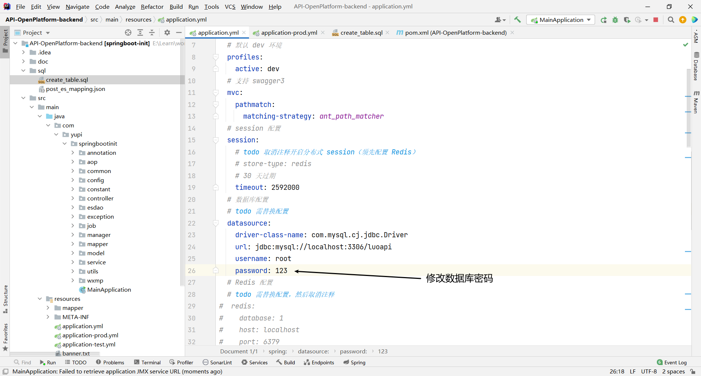
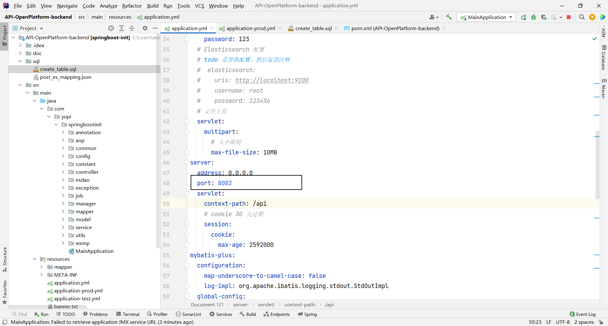

# 落樱接口

背景：

1. 前端开发需要用到后端j接口
2. 使用别人现成系统的功能[搏天api-免费api接口平台 (btstu.cn)](https://api.btstu.cn/)

考虑：

1. 防止攻击（安全性）
2. 不能随便调用（增加限制）
3. 统计调用次数
4. 计费
5. 流量保护（限制单位i时间请求数量）
6. API接入（每开发一个API要复用以上的特性）

## 项目介绍

落樱接口是一个提供接口调用的平台，用户可以注册登录，开通接口调用权限，用户可以调用接口，每次调用会进行统计。

管理员可以发布接口，下线接口，接入接口，可视化接口的调用情况

## 业务流程


## 技术选型

**前端**

- Ant Design Pro

- React

- Ant Design & Pro Components

- Umi
- Umi Request （Axios的封装）

**后端**

- Java
- SpringBoot

## 计划

**初始化和展示**

- 初始化项目
  - 前端
  - 后端

- 接口管理
  - 管理员可以对接口进行增删改查

- 用户查看接口
  - 用户可以访问前台查看，查看接口信息

**接口调用**

- 接口调用

- 接口文档展示，接口在线调用

- 保证调用的安全性（API签名认证）

- 客户端SDK开发

**接口计费与保护**

- 统计用户调用次数

- 限流

- 计费

- 日志

- 开通

**接口统计**

- 提供可视化平台，用图表展示所有接口的调用情况，便于管理
- 接口预警

## 需求分析

1. 管理员可以对接口进行增删改查
2. 用户可以访问前台查看，查看接口信息

## 初始化和展示

### 初始化项目

#### 前端

1. 初始化脚手架

```sh
#使用pro-cli 来快速的初始化脚手架。
npm i @ant-design/pro-cli -g
pro create API-OpenPlatform-frontend
```


2. 确认版本


3. 安装依赖

```sh
yarn
```

#### 后端

使用SpringBoot 项目初始模板











### 接口管理

#### 管理员可以对接口进行增删改查

### 用户查看接口

#### 用户可以访问前台查看，查看接口信息

 